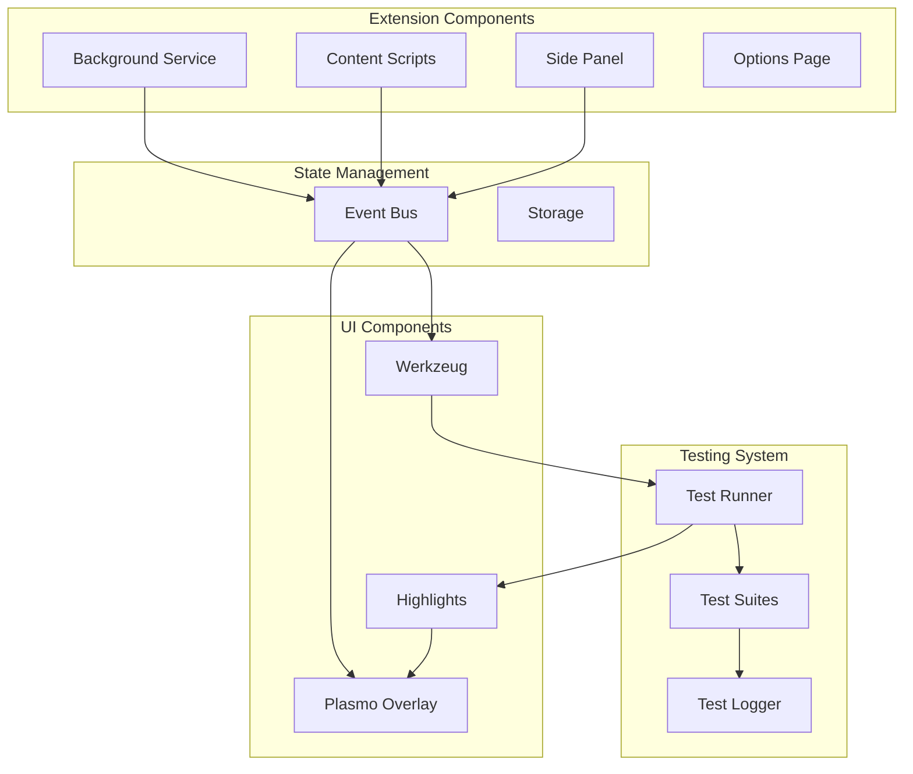
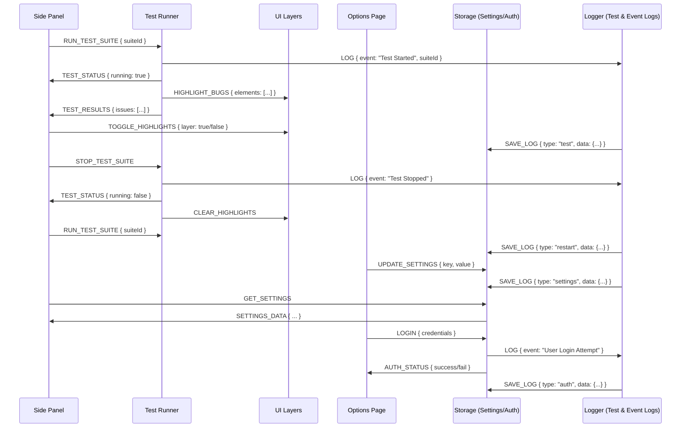
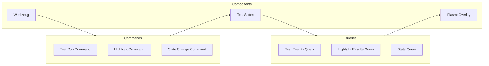
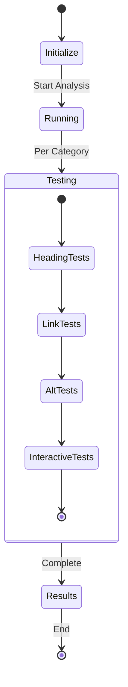

# Allyship Studio

A Chrome extension for real-time accessibility testing and analysis, built with [Plasmo](https://docs.plasmo.com/) and [shadcn/ui](https://ui.shadcn.com/).

## Core Architecture



### Component Communication Flow



This communication flow demonstrates several key improvements:

1. **Clear Message Patterns**

   - Commands: `RUN_TEST_SUITE`, `STOP_TEST_SUITE`, `UPDATE_SETTINGS`
   - Events: `TEST_STATUS`, `HIGHLIGHT_BUGS`, `TEST_RESULTS`
   - Queries: `GET_SETTINGS`, `AUTH_STATUS`

2. **Separation of Concerns**

   - Side Panel: User interaction and test control
   - Test Runner: Test execution and result management
   - UI Layers: Visual feedback and highlighting
   - Storage: Settings and authentication persistence
   - Logger: Comprehensive event tracking

3. **Logging Integration**

   - Every significant action is logged
   - Logs are persisted for debugging
   - Clear audit trail of user actions

4. **State Management**

   ```typescript
   // Message type definitions
   interface TestMessage {
     type: "RUN_TEST_SUITE" | "STOP_TEST_SUITE" | "TEST_STATUS" | "TEST_RESULTS"
     payload: {
       suiteId?: string
       running?: boolean
       issues?: TestIssue[]
     }
   }

   interface UIMessage {
     type: "HIGHLIGHT_BUGS" | "TOGGLE_HIGHLIGHTS" | "CLEAR_HIGHLIGHTS"
     payload: {
       elements?: Element[]
       layer?: boolean
     }
   }

   interface StorageMessage {
     type: "UPDATE_SETTINGS" | "GET_SETTINGS" | "SETTINGS_DATA"
     payload: {
       key?: string
       value?: unknown
       settings?: AppSettings
     }
   }

   interface LogMessage {
     type: "LOG"
     payload: {
       event: string
       type: "test" | "restart" | "settings" | "auth"
       data: Record<string, unknown>
     }
   }
   ```

5. **Error Handling**

   - Clear failure paths
   - Status reporting
   - Error logging
   - Recovery flows

6. **Settings Management**
   - Centralized storage
   - Real-time updates
   - Persistence
   - Access control

This communication pattern provides several benefits:

- Predictable data flow
- Clear responsibility boundaries
- Comprehensive logging
- Type-safe messages
- Easy debugging
- Testable components

## Directory Structure

```
src/
├── background/        # Chrome extension background service
├── components/        # React components and UI elements
├── contents/         # Content scripts for page analysis
├── core/            # Core business logic and services
├── lib/             # Shared utilities and test runners
├── sidepanel/        # Extension side panel UI
├── storage/         # State persistence
├── types/           # TypeScript type definitions
└── utils/           # Helper functions
```

## Key Components

### 1. Test Runner System

The test runner orchestrates accessibility tests and manages results:

```typescript
class ACTTestRunner {
  private suites: ACTSuite[] = []
  private elementResults: Map<string, ElementResult> = new Map()
  private currentTestType: TestType | null = null

  async *runTests(type: TestType): AsyncGenerator<TestUpdate, void, unknown> {
    // Test execution logic
  }
}
```

### 1.1 Test Execution State Machine

The test execution flow is managed by a precise XState state machine, inspired by the Casio F-91W implementation:

```typescript
// Guard conditions
const isValidPage = (context) => !!context.url && !context.url.startsWith('chrome://');
const hasResults = (context) => context.results.length > 0;
const hasErrors = (context) => context.errors.length > 0;
const isTestComplete = (context, event) => event.type === 'TEST_COMPLETE';

// Helper functions
const normalizeResults = (results) => {
  return results.map(result => ({
    ...result,
    timestamp: Date.now(),
    id: generateUUID()
  }));
};

const categorizeResults = (results) => {
  return {
    errors: results.filter(r => r.type === 'error'),
    warnings: results.filter(r => r.type === 'warning'),
    info: results.filter(r => r.type === 'info')
  };
};

// State machine definition
export const accessibilityMachine = createMachine({
  id: 'accessibility',
  initial: 'idle',
  context: {
    url: undefined,
    results: [],
    errors: [],
    currentTest: null,
    testQueue: [],
    highlights: new Map()
  },
  states: {
    idle: {
      on: {
        START_SCAN: [
          {
            cond: 'isValidPage',
            target: 'preparing',
            actions: ['recordURL', 'initializeTestQueue']
          },
          {
            target: 'error',
            actions: ['recordInvalidPageError']
          }
        ]
      }
    },
    preparing: {
      entry: ['resetResults', 'clearHighlights'],
      on: {
        TESTS_READY: 'scanning.structure',
        ERROR: 'error'
      }
    },
    scanning: {
      states: {
        structure: {
          entry: ['startStructureTests'],
          on: {
            TEST_COMPLETE: {
              target: 'headings',
              actions: ['appendResults']
            },
            ERROR: '#accessibility.error'
          }
        },
        headings: {
          entry: ['startHeadingTests'],
          on: {
            TEST_COMPLETE: {
              target: 'links',
              actions: ['appendResults']
            },
            ERROR: '#accessibility.error'
          }
        },
        links: {
          entry: ['startLinkTests'],
          on: {
            TEST_COMPLETE: {
              target: 'interactive',
              actions: ['appendResults']
            },
            ERROR: '#accessibility.error'
          }
        },
        interactive: {
          entry: ['startInteractiveTests'],
          on: {
            TEST_COMPLETE: {
              target: 'media',
              actions: ['appendResults']
            },
            ERROR: '#accessibility.error'
          }
        },
        media: {
          entry: ['startMediaTests'],
          on: {
            TEST_COMPLETE: [
              {
                cond: 'hasResults',
                target: '#accessibility.analyzing'
              },
              {
                target: '#accessibility.complete'
              }
            ],
            ERROR: '#accessibility.error'
          }
        }
      }
    },
    analyzing: {
      entry: ['categorizeResults'],
      on: {
        ANALYSIS_COMPLETE: [
          {
            cond: 'hasErrors',
            target: 'error_summary'
          },
          {
            target: 'complete'
          }
        ]
      }
    },
    error_summary: {
      entry: ['prepareErrorSummary'],
      on: {
        VIEW_DETAILS: 'complete',
        RESTART: 'preparing'
      }
    },
    complete: {
      entry: ['notifyComplete', 'updateHighlights'],
      on: {
        TOGGLE_HIGHLIGHT: {
          actions: ['toggleHighlight']
        },
        NEW_SCAN: 'preparing',
        EXPORT: {
          actions: ['exportResults']
        }
      }
    },
    error: {
      entry: ['logError'],
      on: {
        RETRY: 'preparing',
        RESET: 'idle'
      }
    }
  }
}, {
  guards: {
    isValidPage,
    hasResults,
    hasErrors,
    isTestComplete
  },
  actions: {
    recordURL: assign({
      url: (_, event) => event.url
    }),
    initializeTestQueue: assign({
      testQueue: (context) => [
        'structure',
        'headings',
        'links',
        'interactive',
        'media'
      ]
    }),
    resetResults: assign({
      results: [],
      errors: []
    }),
    clearHighlights: assign({
      highlights: new Map()
    }),
    appendResults: assign({
      results: (context, event) => [
        ...context.results,
        ...normalizeResults(event.results)
      ]
    }),
    categorizeResults: assign({
      results: (context) => categorizeResults(context.results)
    }),
    toggleHighlight: assign({
      highlights: (context, event) => {
        const newHighlights = new Map(context.highlights);
        const id = event.elementId;
        newHighlights.set(id, !newHighlights.get(id));
        return newHighlights;
      }
    }),
    updateHighlights: (context) => {
      // Update DOM highlights
      context.results.forEach(result => {
        updateElementHighlight(result);
      });
    },
    exportResults: (context) => {
      const report = generateAccessibilityReport(context.results);
      downloadReport(report);
    }
  }
});

// Example usage in a React component:
function AccessibilityScanner() {
  const [state, send] = useMachine(accessibilityMachine);

  return (
    <div>
      {state.matches('idle') && (
        <button
          onClick={() => send('START_SCAN', { url: window.location.href })}
          disabled={!isValidPage(window.location.href)}
        >
          Start Accessibility Scan
        </button>
      )}

      {state.matches('scanning') && (
        <ScanProgress
          phase={state.value.scanning}
          results={state.context.results}
        />
      )}

      {state.matches('complete') && (
        <ResultsView
          results={state.context.results}
          highlights={state.context.highlights}
          onToggleHighlight={(id) => send('TOGGLE_HIGHLIGHT', { elementId: id })}
          onExport={() => send('EXPORT')}
        />
      )}

      {state.matches('error') && (
        <ErrorView
          error={state.context.errors[0]}
          onRetry={() => send('RETRY')}
          onReset={() => send('RESET')}
        />
      )}
    </div>
  );
}
```

This state machine provides:

- Precise control over the testing lifecycle
- Clear separation of test phases
- Robust error handling
- Type-safe state transitions
- Granular control over highlights
- Built-in support for result categorization
- Export capabilities

The key improvements over the previous design:

1. Clear separation of scanning phases
2. Explicit error handling paths
3. Granular control over highlights
4. Support for test queueing
5. Built-in result normalization
6. Export functionality
7. Progress tracking per test type

### 2. Event Bus Communication

The event bus implements a CQRS pattern for test execution and results:



```typescript
// Command handlers
interface TestCommand {
  type: "RUN_TEST" | "UPDATE_HIGHLIGHT" | "CHANGE_STATE"
  payload: unknown
}

// Query handlers
interface TestQuery {
  type: "GET_TEST_RESULTS" | "GET_HIGHLIGHTS" | "GET_STATE"
  filter?: unknown
}

// Example usage
commandBus.dispatch({
  type: "RUN_TEST",
  payload: {
    testType: "HEADINGS",
    options: {
      /* ... */
    }
  }
})

const results = await queryBus.execute({
  type: "GET_TEST_RESULTS",
  filter: {
    testType: "HEADINGS"
  }
})
```

This pattern provides:

- Clear separation between commands (actions) and queries (data retrieval)
- Better testability through command/query handlers
- Improved scalability for future test types
- Foundation for event sourcing if needed later

### 3. Highlight System

The highlight system visualizes test results:

```typescript
interface HighlightData {
  selector: string
  message: string
  element: HTMLElement
  isValid: boolean
  layer: string
}
```

## Test Categories

### 1. Heading Structure Tests

- Hierarchy validation
- Accessibility names
- Document structure

### 2. Link Accessibility Tests

- Valid references
- Descriptive text
- Navigation patterns

### 3. Interactive Element Tests

- Keyboard access
- ARIA attributes
- Focus management

## Development

### Prerequisites

- Node.js 18+
- pnpm 8.15.3+
- Chrome browser

### Setup

1. Install dependencies:

```bash
pnpm install
```

2. Set up environment:

```bash
cp .env.example .env
```

3. Development mode:

```bash
pnpm dev
```

### Testing Flow



## Event System

### Core Events

1. Test Control Events

   - `TOOL_STATE_CHANGE`
   - `*_ANALYSIS_REQUEST`
   - `*_ANALYSIS_COMPLETE`

2. UI Events
   - `HIGHLIGHT`
   - `NAVIGATE_REQUEST`

### Event Flow Example

```typescript
// Event publication
eventBus.publish({
  type: "HIGHLIGHT",
  timestamp: Date.now(),
  data: {
    selector: string,
    message: string,
    isValid: boolean,
    layer: string
  }
})

// Event subscription
eventBus.subscribe((event) => {
  if (event.type === "HIGHLIGHT") {
    // Handle highlight updates
  }
})
```

## Best Practices

### 1. Component Development

- Use TypeScript for type safety
- Follow React best practices
- Implement proper cleanup

### 2. Testing

- Write unit tests for utilities
- Test accessibility features
- Validate event handling

### 3. Performance

- Optimize highlight rendering
- Manage event subscriptions
- Clean up resources

## License

Copyright (c) 2024 Allyship.dev. All rights reserved.
