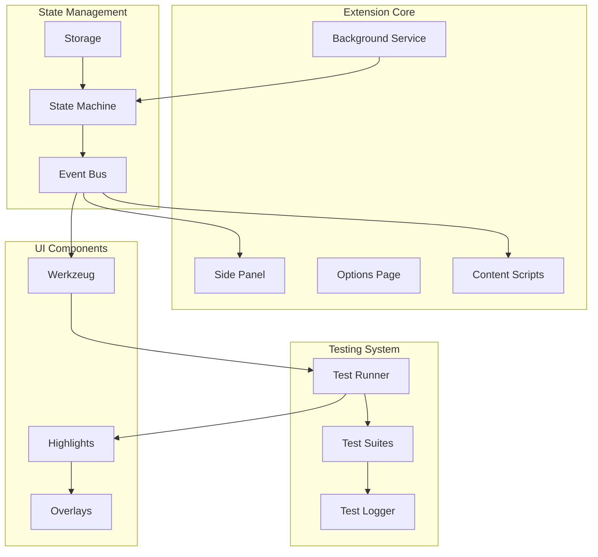
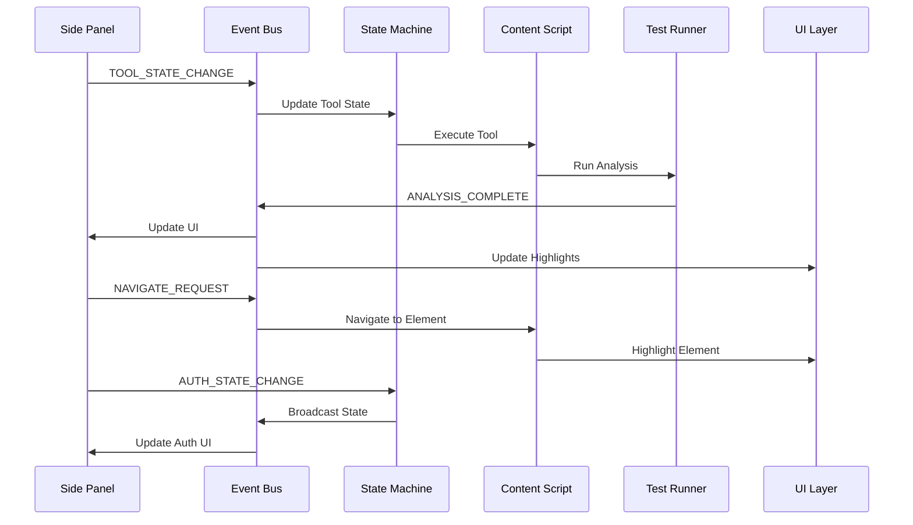
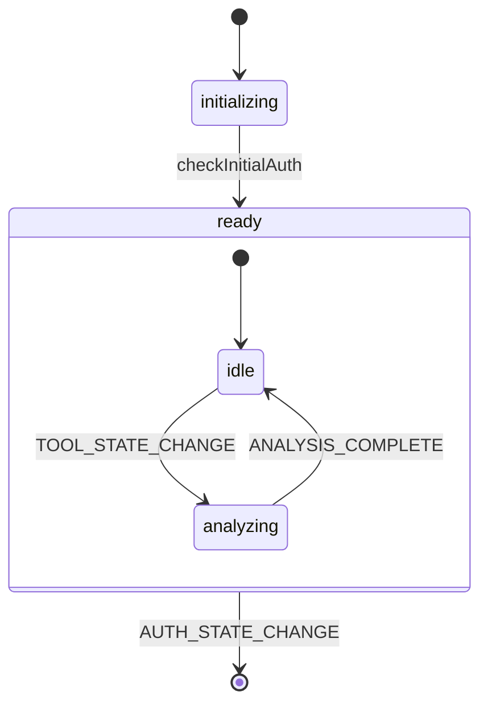

# Allyship Studio

A Chrome extension for real-time accessibility testing and analysis, built with [Plasmo](https://docs.plasmo.com/), [shadcn/ui](https://ui.shadcn.com/), and [XState](https://xstate.js.org/).

## Core Architecture



### Component Communication Flow



### State Machine Flow



## Directory Structure

```
src/
├── background/           # Chrome extension background service
│   ├── handlers/        # Event and message handlers
│   ├── machines/        # State machines
│   └── layers.ts        # Background script layers
├── components/          # React components
├── contents/           # Content scripts
├── core/              # Core business logic
├── lib/               # Shared utilities
│   ├── events/        # Event system
│   └── testing/       # Test runners
├── sidepanel/         # Extension side panel
└── types/             # TypeScript definitions
```

## Key Components

### 1. State Machine

The root state machine manages global application state:

```typescript
interface RootContext {
  activeTabs: Set<number>
  session: any | null
}

type RootEvent =
  | { type: "AUTH_STATE_CHANGE"; event: string; session: any }
  | { type: "TAB_CLOSED"; tabId: number }

const rootMachine = createMachine({
  id: "rootMachine",
  initial: "initializing",
  context: {
    activeTabs: new Set<number>(),
    session: null
  },
  states: {
    initializing: {
      invoke: {
        src: "checkInitialAuth",
        onDone: { target: "ready" }
      }
    },
    ready: {
      on: {
        AUTH_STATE_CHANGE: { actions: "updateSession" },
        TAB_CLOSED: { actions: "cleanupClosedTab" }
      }
    }
  }
})
```

### 2. Event System

The event bus implements a publish/subscribe pattern:

```typescript
interface AllyStudioEvent {
  type: string
  timestamp: number
  tabId?: number
  data?: unknown
}

class EventBus {
  publish(event: AllyStudioEvent): void
  subscribe(handler: (event: AllyStudioEvent) => void): () => void
}
```

### 3. Message Handlers

Dedicated handlers for different message types:

```typescript
// Auth Handler
export function setupAuthHandlers() {
  supabase.auth.onAuthStateChange((event, session) => {
    rootActor.send({
      type: "AUTH_STATE_CHANGE",
      event,
      session
    })
  })
}

// Message Handler
export function setupMessageHandlers() {
  chrome.runtime.onMessage.addListener((message, sender, sendResponse) => {
    if (message.type === "AUTH_STATE_CHECK") {
      const snapshot = rootActor.getSnapshot()
      sendResponse({ session: snapshot.context.session })
      return true
    }
    // ... other message handling
  })
}
```

## Event Types

### Core Events

1. State Events

   - `AUTH_STATE_CHANGE`
   - `TOOL_STATE_CHANGE`

2. Analysis Events

   - `HEADING_ANALYSIS_COMPLETE`
   - `HEADING_NAVIGATE_REQUEST`

3. UI Events
   - `HIGHLIGHT`
   - `NAVIGATE_REQUEST`

## Development

### Prerequisites

- Node.js 18+
- pnpm 8.15.3+
- Chrome browser

### Setup

1. Install dependencies:

```bash
pnpm install
```

2. Development mode:

```bash
pnpm dev
```

### Build

```bash
pnpm build
```

## Best Practices

### 1. State Management

- Use state machines for complex state
- Implement proper cleanup
- Handle edge cases

### 2. Event Handling

- Use typed events
- Implement proper unsubscribe
- Handle errors gracefully

### 3. Testing

- Write unit tests
- Test state transitions
- Validate event flows

## License

Copyright (c) 2024 Allyship.dev. All rights reserved.
