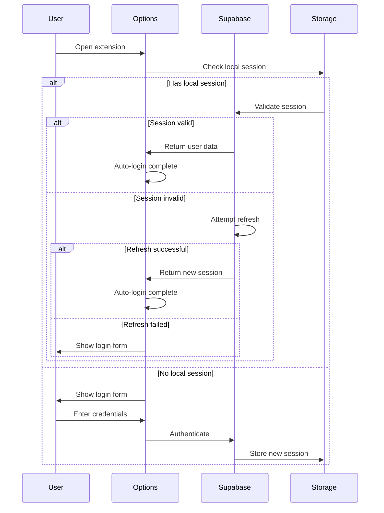

# Allyship Studio

A premium Chrome extension built with [Plasmo](https://docs.plasmo.com/) and [shadcn/ui](https://ui.shadcn.com/) that helps make the web more accessible.

## Architecture Overview

### Core Components

1. **Extension Architecture**

   - **Background Service (`background/`)**

     - Handles extension lifecycle events
     - Manages authentication state
     - Controls sidepanel visibility
     - Coordinates message passing between components

   - **Content Scripts (`contents/`)**

     - Implements accessibility analysis tools
     - Injects overlay UI components
     - Handles DOM manipulation and monitoring
     - Real-time accessibility validation

   - **Sidepanel UI (`sidepanel/`)**

     - Main user interface for accessibility tools
     - Real-time issue reporting
     - Tool activation controls
     - Results visualization

   - **Options Page (`options/`)**
     - Authentication interface
     - User settings management
     - Extension configuration

2. **Tool System Architecture**

   ```typescript
   // Base Tool Structure
   abstract class BaseTool {
     abstract getSelector(): string
     abstract validateElement(el: HTMLElement): ValidationResult
     abstract getLabel(el: HTMLElement): string

     getElements(): NodeListOf<HTMLElement>
     getVisibleElements(): HTMLElement[]
     validateElements(): ElementData[]
   }
   ```

   - **Tool Implementation Pattern**
     - Abstract base class for all tools
     - Standardized validation interface
     - Common utility methods
     - Consistent result format

3. **UI Component Architecture**

   - **Component Layers**

     - Base UI components (`components/ui/`)
     - Tool-specific components (`components/tools/`)
     - Shared layouts and containers (`components/layout/`)
     - Utility components (`components/common/`)

   - **Overlay System**
     ```typescript
     // Overlay Component Pattern
     function ElementHighlightBox({ element, isValid, children, isDark }) {
       // Non-intrusive DOM highlighting
       // Plasmo-managed overlay system
       // Theme-aware styling
     }
     ```

4. **State Management**

   - **Local State**

     - React hooks for component state
     - Tool-specific state management
     - UI state coordination

   - **Global State**
     - Supabase for backend state
     - Chrome storage for extension state
     - Message passing for cross-context state

5. **Communication Architecture**

   ```typescript
   // Message Types
   type Message =
     | { type: "TOOL_STATE_UPDATE"; data: ToolState }
     | { type: "ISSUE_REPORT"; data: IssueData }
     | { type: "AUTH_STATE"; data: AuthState }
   ```

   - **Internal Communication**

     - Chrome message passing
     - Event-based communication
     - State synchronization

   - **External Communication**
     - Supabase real-time updates
     - REST API integration
     - Beacon API for analytics

6. **Data Flow Architecture**

   ```mermaid
   graph TD
     A[Content Script] --> B[Tool System]
     B --> C[Issue Collection]
     C --> D[State Management]
     D --> E[UI Updates]
     D --> F[Backend Sync]
   ```

   - **Validation Flow**

     1. Tool activation
     2. DOM analysis
     3. Issue collection
     4. State update
     5. UI refresh

   - **Data Persistence**
     1. Local caching
     2. Backend synchronization
     3. State restoration

7. **Security Architecture**

   - **Authentication**

     - Supabase JWT handling
     - Secure token storage
     - Session management

   - **Data Protection**
     - Content script isolation
     - Secure message passing
     - Permission boundaries

8. **Performance Optimizations**

   - **DOM Operations**

     ```typescript
     // Performance Pattern
     const rafRef = useRef<number | null>(null)
     const handleResize = useCallback(() => {
       if (rafRef.current) cancelAnimationFrame(rafRef.current)
       rafRef.current = requestAnimationFrame(updateElements)
     }, [])
     ```

   - **Resource Management**
     - RAF-based updates
     - Lazy loading
     - Event debouncing
     - Memory cleanup

9. **Error Handling**

   - **Error Boundaries**

     - Component-level isolation
     - Graceful degradation
     - User feedback

   - **Recovery Strategies**
     - State reset capabilities
     - Fallback UI
     - Error reporting

10. **Testing Architecture**

    - **Unit Testing**

      - Component tests
      - Tool validation tests
      - Utility function tests

    - **Integration Testing**
      - Tool interaction tests
      - State management tests
      - Communication tests

### Directory Structure

```
src/
├── background/        # Extension background service
├── contents/         # Content scripts and tools
├── sidepanel/        # Main UI components
├── options/          # Settings and auth UI
├── components/       # Shared React components
├── core/            # Core business logic
├── lib/             # Utility functions
├── types/           # TypeScript definitions
├── utils/           # Helper functions
└── styles/          # Global styles
```

### Best Practices

1. **Code Organization**

   - Feature-based directory structure
   - Clear separation of concerns
   - Consistent naming conventions

2. **Performance**

   - Minimal DOM operations
   - Efficient state updates
   - Resource cleanup

3. **Security**

   - Content script isolation
   - Secure communication
   - Data validation

4. **Accessibility**
   - WCAG compliance
   - Keyboard navigation
   - Screen reader support

### Future Considerations

1. **Scalability**

   - Tool plugin system
   - Custom rule definitions
   - Performance optimization

2. **Integration**

   - CI/CD pipeline
   - Automated testing
   - Documentation generation

3. **Features**
   - Additional accessibility tools
   - Advanced reporting
   - Team collaboration

## How It Works

### 1. Authentication Flow with Auto-Login



**Auto-Login Implementation:**

```typescript
// Core auto-login logic
export async function attemptAutoLogin() {
  try {
    // 1. Check for existing session
    const {
      data: { session }
    } = await supabase.auth.getSession()

    if (session) {
      // 2. Validate session
      const {
        data: { user }
      } = await supabase.auth.getUser()
      if (user) return { user, session }
    }

    // 3. Try session refresh
    const {
      data: { session: refreshedSession }
    } = await supabase.auth.refreshSession()

    if (refreshedSession) {
      const {
        data: { user }
      } = await supabase.auth.getUser()
      if (user) return { user, session: refreshedSession }
    }

    return null
  } catch (error) {
    // Clear invalid session
    await supabase.auth.signOut()
    return null
  }
}
```

### 2. Storage System

The extension uses a layered storage approach:

1. **Local Extension Storage** (`@plasmohq/storage`)

   - User preferences
   - Session data
   - Cache

2. **Supabase Storage**
   - User data
   - Scan results
   - Settings sync

```typescript
// Storage implementation
const customStorage: SupportedStorage = {
  getItem: async (key: string): Promise<string | null> => {
    try {
      const value = await storage.get(key)
      return value ?? null
    } catch (error) {
      console.error("Storage.getItem error:", error)
      return null
    }
  }
  // ... other methods
}
```

### 3. Environment Configuration

The extension uses Plasmo's environment system:

```env
# Supabase Configuration
PLASMO_PUBLIC_SUPABASE_URL=your_supabase_url
PLASMO_PUBLIC_SUPABASE_ANON_KEY=your_anon_key

# Extension Configuration
PLASMO_PUBLIC_EXTENSION_ID=your_extension_id

# Development Configuration
PLASMO_PUBLIC_DEV_MODE=true
```

### 4. Background Service

The background service handles:

1. Message routing
2. Side panel management
3. Session coordination

```typescript
// Background script (background/index.ts)
chrome.runtime.onMessage.addListener((message, sender, sendResponse) => {
  if (message.type === "OPEN_SIDE_PANEL" && message.windowId) {
    chrome.sidePanel
      .open({ windowId: message.windowId })
      .then(() => sendResponse({ success: true }))
  }
  return true
})
```

## Development

### Prerequisites

- Node.js 18+
- pnpm 8.15.3+
- Chrome browser

### Setup

1. Install dependencies:

```bash
pnpm install
```

2. Set up environment:

```bash
cp .env.example .env
# Edit .env with your credentials
```

3. Development mode:

```bash
pnpm dev
```

4. Build for production:

```bash
pnpm build
```

### Scripts

- `pnpm dev`: Start development server
- `pnpm build`: Create production build
- `pnpm package`: Package for distribution
- `pnpm clean`: Remove build artifacts

## Project Structure

```
apps/allystudio/
├── assets/             # Static assets
├── background/         # Background scripts
├── components/         # React components
│   └── ui/            # shadcn/ui components
├── core/              # Core functionality
│   └── supabase.ts    # Supabase client
├── lib/               # Utility functions
├── types/             # TypeScript types
├── options.tsx        # Options page
└── sidepanel.tsx      # Side panel UI
```

## Security Considerations

1. **Authentication**

   - Secure token storage
   - Automatic token refresh
   - OAuth integration

2. **Data Protection**

   - Local storage encryption
   - Secure message passing
   - Content security policy

3. **Permission Model**
   - Minimal required permissions
   - Host permissions control
   - Feature-based access control

## Best Practices

1. **Code Organization**

   - Feature-based directory structure
   - Clear separation of concerns
   - Type safety throughout

2. **State Management**

   - Local state with React hooks
   - Persistent state with Plasmo storage
   - Background state coordination

3. **Error Handling**
   - Graceful degradation
   - User-friendly error messages
   - Detailed error logging

## License

This software is proprietary and confidential. Unauthorized copying, distribution, or use of this software is strictly prohibited. All rights reserved.

Copyright (c) 2024 Allyship.dev

## Accessibility Testing Architecture

### 1. WCAG Principles Integration

The toolbar is organized around the four fundamental WCAG principles, each with distinct visual indicators:

```typescript
type WCAGPrinciple = "perceivable" | "operable" | "understandable" | "robust"

interface ToolGroup {
  name: string
  icon: LucideIcon
  description: string
  wcagPrinciple?: WCAGPrinciple
  tools: Tool[]
}
```

**Visual Coding System:**

- 🟢 Perceivable (Green): Visual and auditory content tools
- 🔵 Operable (Blue): Keyboard and input method tools
- 🟣 Understandable (Purple): Readability and predictability tools
- 🟡 Robust (Orange): Compatibility and parsing tools

### 2. Tool Categories

#### Visual Perception Tools

- Text Alternatives (WCAG 1.1.1)
- Color Contrast (WCAG 1.4.1-1.4.13)
- Visual Presentation

#### Media & Structure Tools

- Time-based Media (WCAG 1.2.1-1.2.9)
- Content Structure (WCAG 1.3.1-1.3.6)
- Adaptable Content

#### Input & Control Tools

- Keyboard Access (WCAG 2.1.1-2.1.4)
- Timing Controls (WCAG 2.2.1-2.2.6)
- Input Modalities (WCAG 2.5.1-2.5.6)

#### Navigation & Motion Tools

- Navigation Paths (WCAG 2.4.1-2.4.10)
- Motion Control (WCAG 2.3.1-2.3.3)
- Wayfinding

#### Understanding Tools

- Language (WCAG 3.1.1-3.1.6)
- Behavior (WCAG 3.2.1-3.2.5)
- Forms (WCAG 3.3.1-3.3.6)

#### Technical Tools

- Parsing (WCAG 4.1.1-4.1.3)
- Status Messages (WCAG 4.1.3)
- Compatibility

### 3. Tool Implementation

Each tool follows a consistent structure:

```typescript
interface Tool {
  id: string
  name: string
  icon: LucideIcon
  shortcut: string
  description: string
  wcagLevel: "A" | "AA" | "AAA"
  wcagCriteria: string
  category: WCAGPrinciple
  isNew?: boolean
  isExperimental?: boolean
}
```

### 4. Keyboard Navigation

The toolbar implements a comprehensive keyboard shortcut system:

```typescript
useEffect(() => {
  const handleKeyPress = (e: KeyboardEvent) => {
    // Skip if in input/textarea
    if (e.target instanceof HTMLElement) {
      if (["INPUT", "TEXTAREA"].includes(e.target.tagName)) return
    }

    // Find matching tool
    const tool = toolGroups
      .flatMap((g) => g.tools)
      .find((t) => t.shortcut.toLowerCase() === e.key.toLowerCase())

    if (tool) handleToolClick(tool.id)
  }

  window.addEventListener("keydown", handleKeyPress)
  return () => window.removeEventListener("keydown", handleKeyPress)
}, [])
```

### 5. Visual Feedback System

The toolbar provides rich visual feedback through multiple indicators:

1. **WCAG Level Indicators**

   - A: Green (Essential)
   - AA: Blue (Enhanced)
   - AAA: Purple (Optimal)

2. **Feature Status**

   - 🔵 Pulsing Blue Dot: New features
   - 🟡 Yellow Dot: Experimental features

3. **Tool States**
   - Active/Selected state
   - Hover feedback
   - Disabled state
   - Loading state

### 6. Accessibility Features

The toolbar itself follows strict accessibility guidelines:

```typescript
<button
  onClick={() => handleToolClick(toolId)}
  className={buttonClasses}
  aria-label={`${tool.name} (${tool.wcagCriteria})`}
  aria-pressed={isActive}
  data-state={isActive ? "active" : "inactive"}
  disabled={isDisabled}>
  <span className="sr-only">{tool.name}</span>
  <Icon className="h-4 w-4" aria-hidden="true" />
  {/* Status indicators */}
</button>
```

### 7. Tooltips and Documentation

Each tool provides comprehensive information through tooltips:

```typescript
<TooltipContent side="bottom" className="flex items-start gap-2">
  <div className="flex-1">
    <div className="flex items-center gap-1">
      <p className="font-medium">{tool.name}</p>
      <span className="bg-primary/10 px-1 rounded text-[10px]">
        {tool.wcagCriteria}
      </span>
    </div>
    <p className="text-muted-foreground text-[10px]">
      {tool.description}
    </p>
  </div>
  <kbd className="text-[10px] bg-muted px-1 rounded">
    {tool.shortcut}
  </kbd>
</TooltipContent>
```

## Usage Examples

### 1. Quick Accessibility Check

```typescript
// Example of using the quick check tool
async function runQuickCheck() {
  const results = await quickCheck({
    url: currentUrl,
    tests: ["contrast", "aria", "keyboard"]
  })

  return {
    score: results.score,
    issues: results.issues,
    recommendations: results.recommendations
  }
}
```

### 2. Keyboard Testing

```typescript
// Example of keyboard navigation test
async function testKeyboardNavigation() {
  const results = await keyboardTest({
    focusOrder: true,
    trapFocus: true,
    shortcuts: true
  })

  return {
    focusableElements: results.elements,
    focusTraps: results.traps,
    missingHandlers: results.missing
  }
}
```

### 3. Color Contrast Analysis

```typescript
// Example of contrast checking
async function checkContrast() {
  const results = await contrastAnalyzer({
    elements: document.querySelectorAll("*"),
    includeImages: true
  })

  return {
    failures: results.failures,
    warnings: results.warnings,
    recommendations: results.fixes
  }
}
```

## Best Practices for Tool Development

1. **Consistency**

   - Follow established naming conventions
   - Use consistent visual indicators
   - Maintain uniform keyboard shortcuts

2. **Performance**

   - Lazy load tools when possible
   - Cache results appropriately
   - Minimize DOM operations

3. **Accessibility**

   - Ensure tools are keyboard accessible
   - Provide clear visual feedback
   - Include proper ARIA attributes

4. **Error Handling**
   - Graceful degradation
   - Clear error messages
   - Recovery options

## Future Enhancements

1. **AI-Powered Testing**

   - Automated WCAG compliance checking
   - Smart recommendations
   - Pattern recognition

2. **Advanced Visualization**

   - DOM tree visualization
   - Accessibility flow mapping
   - Issue heat maps

3. **Collaboration Features**

   - Team sharing
   - Issue tracking
   - Progress monitoring

4. **Custom Tools**
   - Tool creation framework
   - Custom rule sets
   - Plugin system
