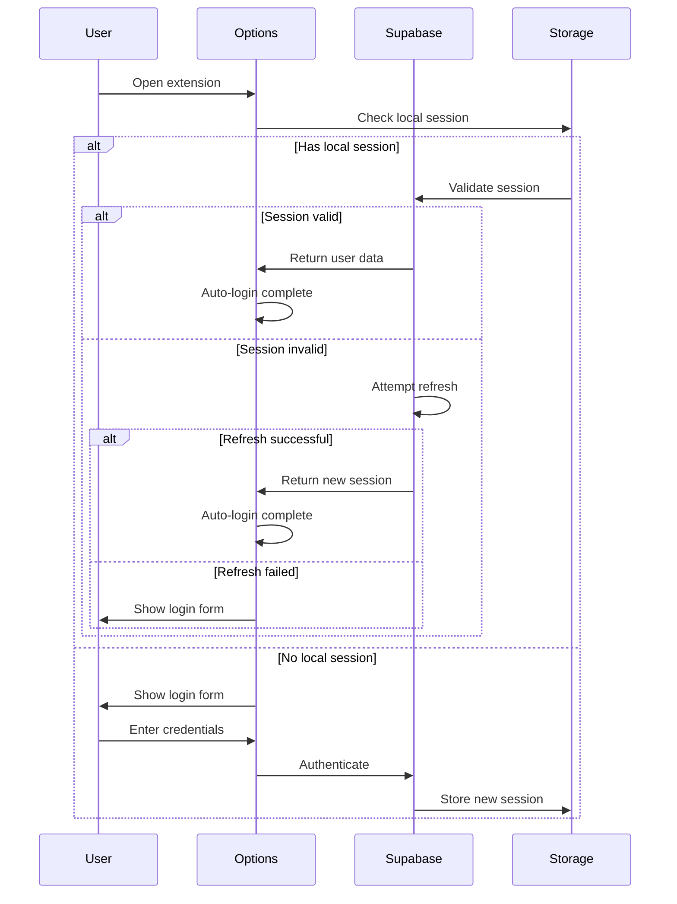

# Allyship Studio

A premium Chrome extension built with [Plasmo](https://docs.plasmo.com/) and [shadcn/ui](https://ui.shadcn.com/) that helps make the web more accessible.

## Architecture Overview

### Core Components

1. **Authentication System**

   - Built on Supabase Auth with auto-login support
   - Multi-step session validation and refresh
   - Supports email/password and OAuth (GitHub) login
   - Persistent session management using `@plasmohq/storage`
   - Secure token handling and refresh mechanism

2. **Extension UI**

   - Options Page: Full-screen authentication interface with auto-login
   - Side Panel: Main accessibility tools interface
   - Theme Support: System/light/dark mode using shadcn/ui

3. **Background Service**
   - Handles message passing between components
   - Manages side panel state
   - Coordinates with content scripts

### Technical Stack

```
Frontend:
├── React 18
├── TypeScript
├── shadcn/ui (Radix UI + Tailwind)
└── Plasmo Framework

Backend:
└── Supabase
    ├── Auth
    ├── Database
    └── Storage

Build Tools:
├── pnpm (Package Manager)
├── PostCSS
└── Tailwind CSS
```

## How It Works

### 1. Authentication Flow with Auto-Login



**Auto-Login Implementation:**

```typescript
// Core auto-login logic
export async function attemptAutoLogin() {
  try {
    // 1. Check for existing session
    const {
      data: { session }
    } = await supabase.auth.getSession()

    if (session) {
      // 2. Validate session
      const {
        data: { user }
      } = await supabase.auth.getUser()
      if (user) return { user, session }
    }

    // 3. Try session refresh
    const {
      data: { session: refreshedSession }
    } = await supabase.auth.refreshSession()

    if (refreshedSession) {
      const {
        data: { user }
      } = await supabase.auth.getUser()
      if (user) return { user, session: refreshedSession }
    }

    return null
  } catch (error) {
    // Clear invalid session
    await supabase.auth.signOut()
    return null
  }
}
```

### 2. Storage System

The extension uses a layered storage approach:

1. **Local Extension Storage** (`@plasmohq/storage`)

   - User preferences
   - Session data
   - Cache

2. **Supabase Storage**
   - User data
   - Scan results
   - Settings sync

```typescript
// Storage implementation
const customStorage: SupportedStorage = {
  getItem: async (key: string): Promise<string | null> => {
    try {
      const value = await storage.get(key)
      return value ?? null
    } catch (error) {
      console.error("Storage.getItem error:", error)
      return null
    }
  }
  // ... other methods
}
```

### 3. Environment Configuration

The extension uses Plasmo's environment system:

```env
# Supabase Configuration
PLASMO_PUBLIC_SUPABASE_URL=your_supabase_url
PLASMO_PUBLIC_SUPABASE_ANON_KEY=your_anon_key

# Extension Configuration
PLASMO_PUBLIC_EXTENSION_ID=your_extension_id

# Development Configuration
PLASMO_PUBLIC_DEV_MODE=true
```

### 4. Background Service

The background service handles:

1. Message routing
2. Side panel management
3. Session coordination

```typescript
// Background script (background/index.ts)
chrome.runtime.onMessage.addListener((message, sender, sendResponse) => {
  if (message.type === "OPEN_SIDE_PANEL" && message.windowId) {
    chrome.sidePanel
      .open({ windowId: message.windowId })
      .then(() => sendResponse({ success: true }))
  }
  return true
})
```

## Development

### Prerequisites

- Node.js 18+
- pnpm 8.15.3+
- Chrome browser

### Setup

1. Install dependencies:

```bash
pnpm install
```

2. Set up environment:

```bash
cp .env.example .env
# Edit .env with your credentials
```

3. Development mode:

```bash
pnpm dev
```

4. Build for production:

```bash
pnpm build
```

### Scripts

- `pnpm dev`: Start development server
- `pnpm build`: Create production build
- `pnpm package`: Package for distribution
- `pnpm clean`: Remove build artifacts

## Project Structure

```
apps/allystudio/
├── assets/             # Static assets
├── background/         # Background scripts
├── components/         # React components
│   └── ui/            # shadcn/ui components
├── core/              # Core functionality
│   └── supabase.ts    # Supabase client
├── lib/               # Utility functions
├── types/             # TypeScript types
├── options.tsx        # Options page
└── sidepanel.tsx      # Side panel UI
```

## Security Considerations

1. **Authentication**

   - Secure token storage
   - Automatic token refresh
   - OAuth integration

2. **Data Protection**

   - Local storage encryption
   - Secure message passing
   - Content security policy

3. **Permission Model**
   - Minimal required permissions
   - Host permissions control
   - Feature-based access control

## Best Practices

1. **Code Organization**

   - Feature-based directory structure
   - Clear separation of concerns
   - Type safety throughout

2. **State Management**

   - Local state with React hooks
   - Persistent state with Plasmo storage
   - Background state coordination

3. **Error Handling**
   - Graceful degradation
   - User-friendly error messages
   - Detailed error logging

## License

This software is proprietary and confidential. Unauthorized copying, distribution, or use of this software is strictly prohibited. All rights reserved.

Copyright (c) 2024 Allyship.dev
