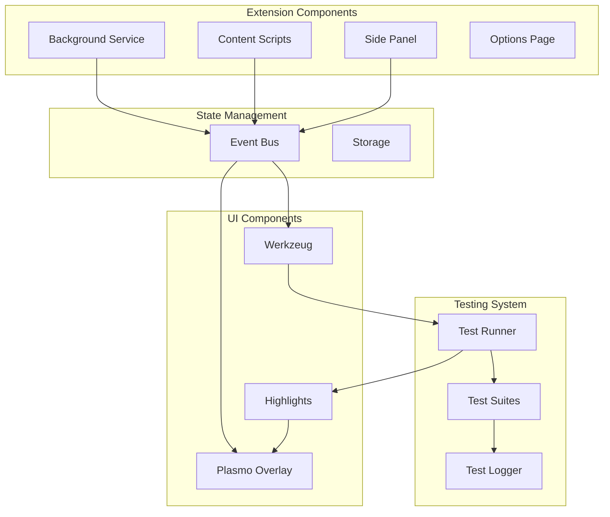
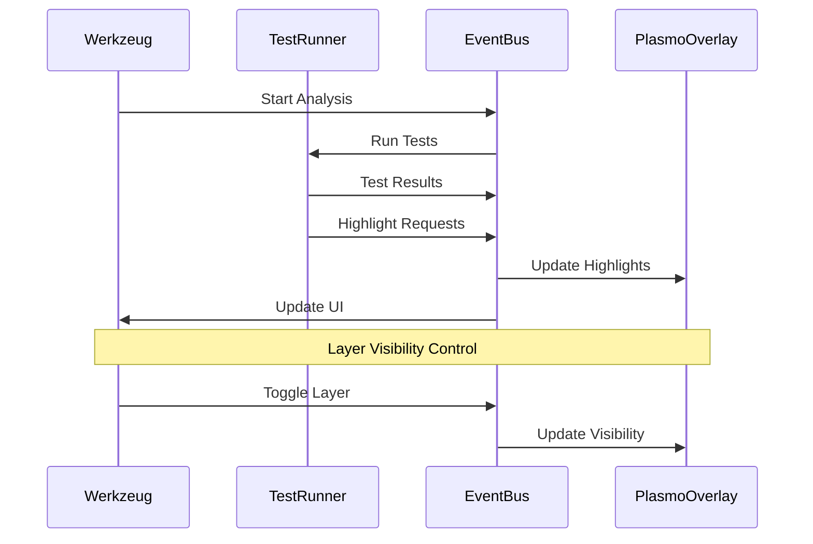
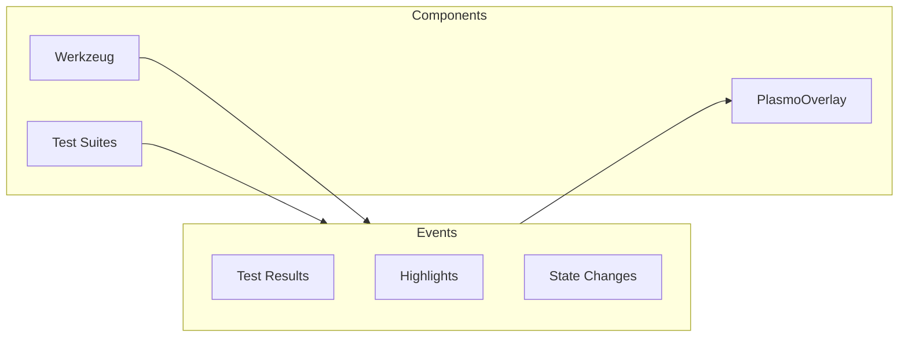
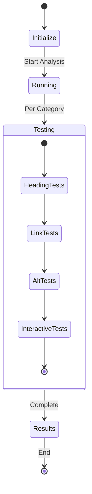

# Allyship Studio

A Chrome extension for real-time accessibility testing and analysis, built with [Plasmo](https://docs.plasmo.com/) and [shadcn/ui](https://ui.shadcn.com/).

## Core Architecture



### Component Communication Flow



## Directory Structure

```
src/
├── background/        # Chrome extension background service
├── components/        # React components and UI elements
├── contents/         # Content scripts for page analysis
├── core/            # Core business logic and services
├── lib/             # Shared utilities and test runners
├── sidepanel/        # Extension side panel UI
├── storage/         # State persistence
├── types/           # TypeScript type definitions
└── utils/           # Helper functions
```

## Key Components

### 1. Test Runner System

The test runner orchestrates accessibility tests and manages results:

```typescript
class ACTTestRunner {
  private suites: ACTSuite[] = []
  private elementResults: Map<string, ElementResult> = new Map()
  private currentTestType: TestType | null = null

  async *runTests(type: TestType): AsyncGenerator<TestUpdate, void, unknown> {
    // Test execution logic
  }
}
```

### 2. Event Bus Communication

The event bus manages all component communication:



### 3. Highlight System

The highlight system visualizes test results:

```typescript
interface HighlightData {
  selector: string
  message: string
  element: HTMLElement
  isValid: boolean
  layer: string
}
```

## Test Categories

### 1. Heading Structure Tests

- Hierarchy validation
- Accessibility names
- Document structure

### 2. Link Accessibility Tests

- Valid references
- Descriptive text
- Navigation patterns

### 3. Interactive Element Tests

- Keyboard access
- ARIA attributes
- Focus management

## Development

### Prerequisites

- Node.js 18+
- pnpm 8.15.3+
- Chrome browser

### Setup

1. Install dependencies:

```bash
pnpm install
```

2. Set up environment:

```bash
cp .env.example .env
```

3. Development mode:

```bash
pnpm dev
```

### Testing Flow



## Event System

### Core Events

1. Test Control Events

   - `TOOL_STATE_CHANGE`
   - `*_ANALYSIS_REQUEST`
   - `*_ANALYSIS_COMPLETE`

2. UI Events
   - `HIGHLIGHT`
   - `NAVIGATE_REQUEST`

### Event Flow Example

```typescript
// Event publication
eventBus.publish({
  type: "HIGHLIGHT",
  timestamp: Date.now(),
  data: {
    selector: string,
    message: string,
    isValid: boolean,
    layer: string
  }
})

// Event subscription
eventBus.subscribe((event) => {
  if (event.type === "HIGHLIGHT") {
    // Handle highlight updates
  }
})
```

## Best Practices

### 1. Component Development

- Use TypeScript for type safety
- Follow React best practices
- Implement proper cleanup

### 2. Testing

- Write unit tests for utilities
- Test accessibility features
- Validate event handling

### 3. Performance

- Optimize highlight rendering
- Manage event subscriptions
- Clean up resources

## License

Copyright (c) 2024 Allyship.dev. All rights reserved.
