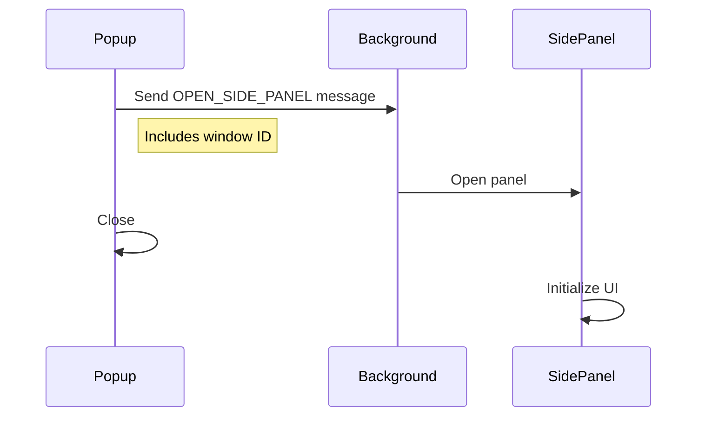

# Allyship Studio

A premium Chrome extension built with [Plasmo](https://docs.plasmo.com/) and [shadcn/ui](https://ui.shadcn.com/) that helps make the web more accessible.

## Features

- 🎨 Modern UI using shadcn/ui components
- 🚀 Built with Plasmo framework for Chrome extensions
- 📱 Side panel interface for easy access
- ⚡️ Fast and responsive
- 💼 Professional-grade accessibility tools
- 🔒 Enterprise-ready security

## Licensing

This is a commercial product. Usage requires a valid license. Contact us for:

- Individual licenses
- Team licenses
- Enterprise licenses
- Custom solutions

For pricing and licensing inquiries, please contact: [Your Contact Information]

## Development

### Prerequisites

- Node.js 18+
- pnpm (recommended) or npm
- Valid development license

### Setup

1. Clone the repository (requires access)
2. Install dependencies:

```bash
pnpm install
```

3. Start the development server:

```bash
pnpm dev
```

4. Load the extension in Chrome:
   - Open Chrome and go to `chrome://extensions`
   - Enable "Developer mode"
   - Click "Load unpacked"
   - Select the `build/chrome-mv3-dev` directory

### Project Structure

```
apps/allystudio/
├── components/          # React components
│   ├── ui/             # shadcn/ui components
│   └── login-form.tsx  # Login form component
├── lib/                # Utility functions
├── popup.tsx           # Extension popup
├── sidepanel.tsx       # Side panel interface
└── background.ts       # Background script
```

### How It Works

1. **Popup Interface**

   - When you click the extension icon, it opens a popup with a login form
   - The form is built using shadcn/ui components for a modern look and feel

2. **Side Panel Integration**

   - After logging in, the extension opens a side panel
   - Communication flow:
     1. Popup gets current window ID using `chrome.windows.getCurrent()`
     2. Sends message to background script with window ID
     3. Background script opens side panel in the correct window

3. **Background Script**
   - Handles messages from the popup
   - Controls side panel opening/closing
   - Manages extension state

### Extension Flow



## Building for Production

1. Build the extension:

```bash
pnpm build
```

2. The production build will be in `build/chrome-mv3-prod`

## Legal

This software is proprietary and confidential. Unauthorized copying, distribution, or use of this software is strictly prohibited. All rights reserved.

Copyright (c) 2024 Allyship.dev
