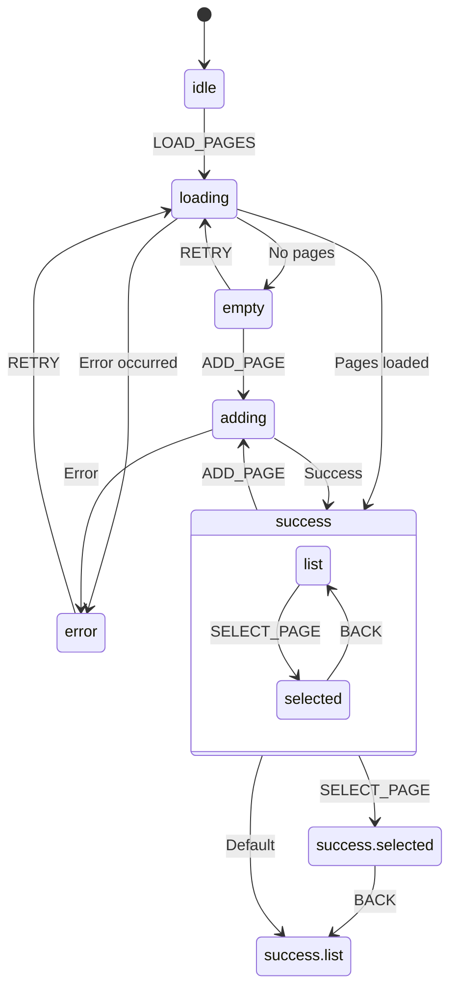
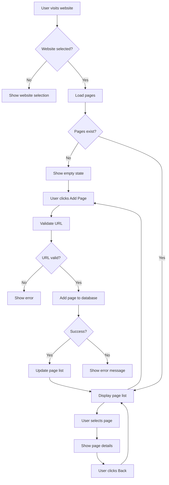
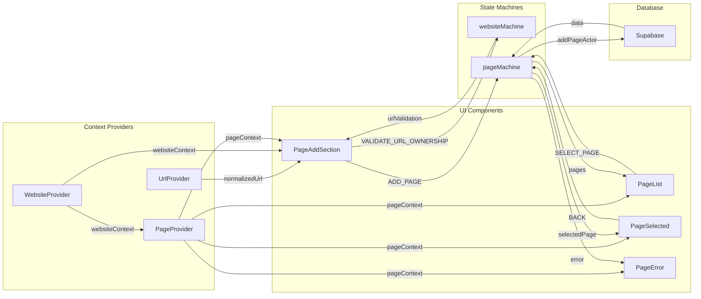
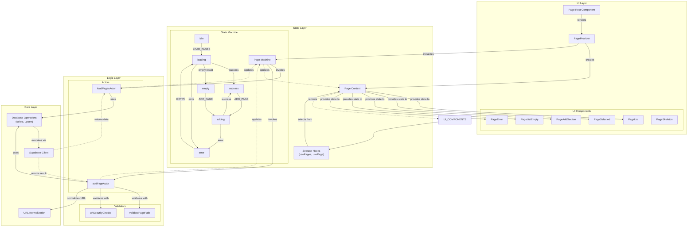
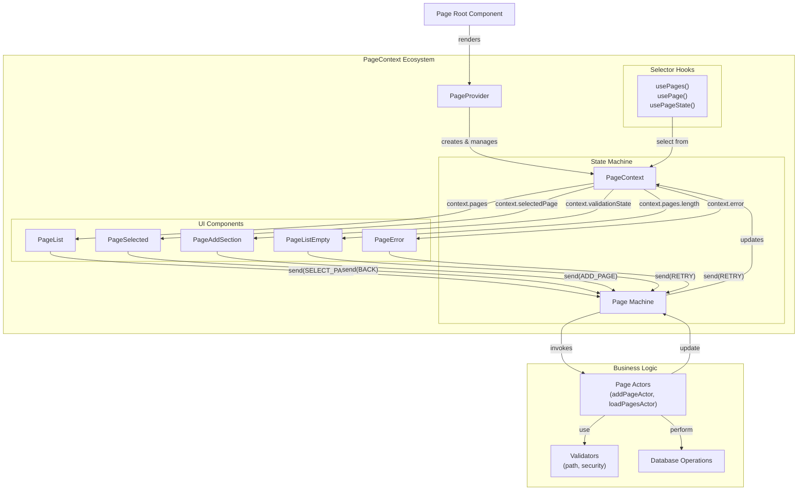

# Page Component

## Overview

The Page component provides functionality for managing and displaying pages associated with a website in the Allyship Studio application. It uses XState for state management and React Context for passing state throughout the component tree.

## Architecture

The Page component follows a state machine architecture using XState:

```
Space → Website → Page
```

Pages exist within the context of a Website, which exists within a Space.

## Flow Diagrams

### State Machine Flow



### User Interaction Flow



### Component Logic Flow



### Architectural Layers Flow

```mermaid
flowchart TB
    %% Presentation Layer
    subgraph "Presentation Layer"
        subgraph "Components"
            UI_ADD[PageAddSection]
            UI_LIST[PageList]
            UI_DETAIL[PageSelected]
            UI_ERROR[PageError]
            UI_EMPTY[PageListEmpty]
        end
    end

    %% State Management Layer
    subgraph "State Management Layer"
        subgraph "Context Providers"
            CP_URL[UrlProvider]
            CP_WEBSITE[WebsiteProvider]
            CP_PAGE[PageProvider]
        end

        subgraph "State Machines"
            SM_WEBSITE[websiteMachine]
            SM_PAGE[pageMachine]
        end
    end

    %% Business Logic Layer
    subgraph "Business Logic Layer"
        subgraph "Actors"
            ACTOR_ADD[addPageActor]
            ACTOR_LOAD[loadPagesActor]
        end

        subgraph "Validators"
            VALIDATE_URL[validateWebsiteUrl]
            VALIDATE_PATH[validatePagePath]
            SECURITY[securityChecks]
        end
    end

    %% Data Access Layer
    subgraph "Data Access Layer"
        subgraph "Database Operations"
            DB_QUERY[Queries]
            DB_UPSERT[Upserts]
            DB_CONSTRAINTS[Constraints]
        end

        subgraph "External Services"
            SUPABASE[Supabase Client]
        end
    end

    %% Cross-cutting Concerns
    subgraph "Cross-cutting Concerns"
        LOGGING[Logging]
        ERROR_HANDLING[Error Handling]
        SECURITY_MONITORING[Security Monitoring]
    end

    %% Data Flow: Top to Bottom (User Actions -> Database)
    UI_ADD -->|"1. User adds page"| CP_PAGE
    UI_LIST -->|"2. User selects page"| CP_PAGE
    UI_DETAIL -->|"3. User navigates back"| CP_PAGE

    CP_URL -->|"4. Provides normalized URL"| SM_PAGE
    CP_WEBSITE -->|"5. Provides website context"| SM_PAGE
    CP_PAGE -->|"6. Dispatches events"| SM_PAGE
    CP_PAGE -->|"7. URL ownership validation"| SM_WEBSITE

    SM_WEBSITE -->|"8. Domain validation"| VALIDATE_URL
    SM_PAGE -->|"9. Invokes actors"| ACTOR_ADD
    SM_PAGE -->|"10. Invokes actors"| ACTOR_LOAD

    ACTOR_ADD -->|"11. Validates input"| VALIDATE_PATH
    ACTOR_ADD -->|"12. Security checks"| SECURITY
    ACTOR_LOAD -->|"13. Fetches pages"| DB_QUERY

    VALIDATE_PATH -->|"14. Reports validation"| SM_PAGE
    SECURITY -->|"15. Enforces ownership"| SM_PAGE
    SECURITY -->|"16. Logs violations"| LOGGING

    ACTOR_ADD -->|"17. Creates records"| DB_UPSERT
    DB_UPSERT -.->|"18. Enforces constraints"| DB_CONSTRAINTS

    DB_QUERY -->|"19. Executes queries"| SUPABASE
    DB_UPSERT -->|"20. Executes upserts"| SUPABASE

    SUPABASE -->|"21. Returns data"| ACTOR_LOAD
    SUPABASE -->|"22. Returns result"| ACTOR_ADD

    %% Data Flow: Bottom to Top (Database -> UI Updates)
    ACTOR_LOAD -->|"23. Updates state"| SM_PAGE
    ACTOR_ADD -->|"24. Updates state"| SM_PAGE

    SM_PAGE -->|"25. Updates context"| CP_PAGE

    CP_PAGE -->|"26. Renders pages"| UI_LIST
    CP_PAGE -->|"27. Renders selected"| UI_DETAIL
    CP_PAGE -->|"28. Renders errors"| UI_ERROR
    CP_PAGE -->|"29. Renders empty"| UI_EMPTY

    %% Error handling flow
    ERROR_HANDLING -.->|"Monitors"| SM_PAGE
    ERROR_HANDLING -.->|"Reports UI errors"| UI_ERROR
    SECURITY_MONITORING -.->|"Audits"| SECURITY
```



### Page Component Architecture



### Page Component Architecture (Focused)



The updated diagram focuses on the PageContext as the central element of the architecture. Key improvements:

1. **Clear Context Boundaries**: The PageContext ecosystem is now shown as a cohesive unit with well-defined boundaries
2. **Bidirectional Data Flow**: Shows how components both consume context data and dispatch events back to the state machine
3. **Specific Data Relationships**: Each UI component is now shown with the specific context data it uses (e.g., PageList uses context.pages)
4. **Event-based Communication**: Visualizes how UI components send events to the state machine to trigger state changes
5. **Simplified Business Logic**: The business logic layer is condensed to focus on the context relationships

This approach better illustrates how the PageContext acts as the central hub connecting the state machine, UI components, and business logic in a clean, unidirectional data flow.

## State Management

The Page component uses XState for state management with the following key states:

- `idle`: Initial state before any loading occurs
- `loading`: Loading pages from the database
- `error`: Error state when loading fails
- `empty`: When no pages exist for the website
- `loaded`: When pages have been successfully loaded
- `selected`: When a specific page is selected
- `adding`: When a new page is being added to the database

### Events

- `LOAD_PAGES`: Trigger loading pages for a website
- `WEBSITE_CHANGED`: When the parent website changes
- `RETRY`: Retry loading after an error
- `SELECT_PAGE`: Select a specific page
- `BACK`: Go back to the page list
- `ADD_PAGE`: Add a new page to the current website
- `VALIDATE_PATH`: Validate a path for adding a new page
- `URL_CHANGED`: Handle when the current URL changes
- `CLEAR_MESSAGES`: Clear validation messages

## Component Structure

The Page module uses a composite component pattern to provide a clean API and separation of concerns.

### Core Components

```jsx
// Example usage in page.tsx
<PageProvider websiteId={currentWebsite.id}>
  <Skeleton />
  <PageError />
  <PageAddSection />
  <PageList />
  <PageListEmpty />
  <PageListSkeleton />
  <PageSelected>{children}</PageSelected>
  {debug && <PageDebug />}
</PageProvider>
```

### Component Separation

To prevent performance issues and unnecessary re-renders, the Page module uses a careful separation of components:

1. **Separate UI Components**: Different visual aspects of the UI are broken into distinct components, each with its own well-defined responsibility
2. **Isolated State Consumers**: Each component only subscribes to the state data it needs through selective selectors
3. **Memoized Components**: All components are wrapped with `React.memo()` to prevent re-renders when props haven't changed

For example, the page addition UI is now split into two components:

- `PageAddSection`: Lightweight header with "Pages" title and add button
- `PageAdd`: Full implementation of page addition logic

This prevents the entire page list from re-rendering when a user adds a new page.

## Performance Optimizations

The Page component implements several performance optimizations:

### Selective Re-rendering

```jsx
// In page-list.tsx
export const PageList = memo(function PageList() {
  // Only subscribe to state needed by this component
  const isSuccess = useSelector(actor, (state) =>
    state.matches({ success: "list" })
  )
  const pages = useSelector(actor, (state) => state.context.pages)

  // Rest of component...
})
```

### Optimistic Updates

When adding a page, the UI is updated optimistically before the server confirms the operation:

1. UI enters "adding" state immediately on button click
2. Button is disabled and shows loading state
3. Server request is made in the background
4. UI reacts to success or error as needed

### Compact UI Elements

The page addition UI has been optimized for density:

- Compact header with "Pages" label on the left
- Small icon button on the right for adding pages
- Tooltips for additional context without cluttering the UI

## Business Logic

The Page component centralizes business logic in the state machine to ensure consistent behavior across the application.

### URL Validation

URL validation is handled by dedicated functions and actions in the state machine:

```typescript
// In page-machine.ts
const validatePagePath = (path: string): string | null => {
  if (!path.startsWith("/")) {
    return "Path must start with /"
  }
  if (path.includes("?") || path.includes("#")) {
    return "Path cannot contain query parameters or fragments"
  }
  return null
}
```

Components dispatch validation events rather than performing validation themselves:

```typescript
// In page-add.tsx
pageActor.send({
  type: "VALIDATE_PATH",
  path
})
```

### URL-Website Relationship

The website machine handles checking if a URL belongs to a website:

```typescript
// In website-machine.ts
function urlBelongsToWebsite(url: string, website: Website): boolean {
  try {
    const urlInfo = normalizeUrlUtil(url)
    const urlDomain = urlInfo.domain
    const websiteUrlInfo = normalizeUrlUtil(website.url)
    const websiteDomain = websiteUrlInfo.domain
    return urlDomain === websiteDomain
  } catch (error) {
    return false
  }
}
```

Components request validation through events:

```typescript
// In page-add.tsx
websiteActor.send({
  type: "VALIDATE_URL_OWNERSHIP",
  url: `https://${normalizedUrl.hostname}${normalizedUrl.path}`
})
```

### Message Handling

Success and error messages are managed centrally in the state machine context:

```typescript
// In page-machine.ts context
pageValidationError: string | null
pageValidationSuccess: string | null
```

Components retrieve these messages through selectors:

```typescript
// In page-add.tsx
const { pageValidationError, pageValidationSuccess } = useSelector(
  pageActor,
  (state) => ({
    pageValidationError: state.context.pageValidationError,
    pageValidationSuccess: state.context.pageValidationSuccess
  }),
  Object.is
)
```

## URL Handling

### Normalized URL Format

Pages use a specific URL format to ensure uniqueness and proper navigation:

- `normalized_url`: Combined hostname + path (e.g., "example.com/blog")
- `path`: The path component only (e.g., "/blog")
- `url`: The full URL including protocol (e.g., "https://example.com/blog")

When adding a new page, the normalized URL is constructed by:

```typescript
// Extract hostname from the website's normalized_url
const hostname = currentWebsite.normalized_url.replace(/^https?:\/\//, "")
// Combine hostname and path
const combinedNormalizedUrl = `${hostname}${path}`
```

### URL Provider Integration

The Page component now uses the centralized `url-provider` for current URL tracking instead of handling it internally:

```typescript
// In page-add.tsx
import { useUrl } from "@/providers/url-provider"

export function PageAdd() {
  const { normalizedUrl, isLoading } = useUrl()

  // Use normalizedUrl directly from the provider
  // for validation and page creation
}
```

This simplifies the page-machine by:

1. Removing URL state tracking from the page context
2. Eliminating the need for URL_CHANGED events
3. Centralizing URL normalization and validation logic
4. Providing consistent URL information across components

The url-provider manages:

- Current browser tab URL tracking
- URL normalization and parsing
- Loading states for URL changes

### Security Checks

The Page component implements multi-layered security checks to ensure pages can only be added to their appropriate website:

1. **Client-side UI Validation**:

   ```typescript
   // In page-add.tsx
   if (hostname !== normalizedUrl.hostname) {
     console.error(
       "Security violation: Attempting to add page to different website",
       { hostname, currentUrl: normalizedUrl.hostname }
     )
     // Disable button and show error
   }
   ```

2. **State Machine Validation**:

   ```typescript
   // In website-machine.ts
   const urlBelongsToWebsite = (url, website) => {
     // Check if url domain matches website domain
     return urlDomain === websiteDomain
   }
   ```

3. **Actor Function Validation**:

   ```typescript
   // In page-machine.ts (addPageActor)
   // Extract hostname parts for security check
   const pageHostnamePart = pageNormalizedUrl.split("/")[0]
   const websiteHostname = currentWebsite.normalized_url.replace(/^https?:\/\//, "")

   // Security check: verify page belongs to this website
   if (pageHostnamePart !== websiteHostname) {
     console.error("SECURITY VIOLATION: Attempt to add page to different website", {
       pageHostname: pageHostnamePart,
       websiteHostname
     })
     return { success: false, error: "Security violation: URL doesn't belong to this website" }
   }
   ```

4. **Database Constraint**:
   Pages are uniquely identified by the combination of `website_id` and `normalized_url`, preventing duplicate pages and ensuring pages belong to their proper website.

### Database Operations

Page uniqueness is enforced at the database level with a constraint on `(website_id, normalized_url)`. The component uses Supabase's upsert operation to handle potential duplicates:

```typescript
// In page-machine.ts
const { data, error } = await supabase
  .from("Page")
  .upsert(input.payload, { onConflict: "normalized_url,website_id" })
  .select()
  .single()
```

This ensures that:

1. Each page is uniquely identified by its website and normalized URL
2. Attempting to add a duplicate page will update the existing one

## Best Practices

1. Always access page state through the context hooks
2. Handle loading and error states appropriately
3. Use the debug component during development to inspect state
4. Follow the event-based pattern for state transitions
5. Ensure normalized_url follows the hostname + path pattern for uniqueness
6. Delegate business logic like validation to state machines
7. Use the centralized URL utilities rather than implementing custom URL logic
8. Let the website machine handle URL-website relationship checks
9. Never bypass security checks when adding pages to websites
10. Always maintain the multi-layered security approach (UI, state machine, actor function, database)
11. Log potential security violations for monitoring and auditing
12. Verify that the hostname of a page always matches the hostname of its parent website
13. Use React.memo for components to prevent unnecessary re-renders
14. Split complex components into smaller focused ones to allow selective updates
15. Use selectors with Object.is comparison to prevent state thrashing

## Accessibility

The Page component implements accessibility best practices:

- Proper ARIA attributes for dynamic content
- Loading indicators with appropriate ARIA roles
- Error messages with role="alert"
- Focus management between page states
- Tooltips for contextual information
- Using aria-labelledby instead of aria-label for better translation support
- Including sr-only text for screen readers
- Marking icons as aria-hidden="true" to prevent duplicate announcements
- Dynamic tooltips that reflect current state (e.g., "Page already added", "Adding page...")
- Unique IDs for ARIA references using React's useId() hook
- Appropriate button states for loading, disabled, and error conditions
- Keyboard navigable interface with proper focus styles

## Related Components

- `Space`: Parent component that provides space context
- `Website`: Intermediary component that provides website context within a space
- Child components that consume page context

## Future Improvements

Future enhancements to consider for the Page module:

1. **Drag and Drop Reordering**: Allow users to reorder pages using drag and drop
2. **Batch Operations**: Support selecting multiple pages for bulk actions
3. **Selective Loading**: Implement pagination or virtual scrolling for sites with many pages
4. **Advanced Filtering**: Add search and filter capabilities for large page collections
5. **Offline Support**: Cache pages locally for offline access
6. **Change Tracking**: Show which pages have been modified since last scan
7. **Detailed Analytics**: Integrate with analytics to show page-specific metrics
8. **Custom Metadata**: Allow users to add custom metadata to pages
9. **Keyboard Shortcuts**: Add keyboard shortcuts for common operations
10. **Enhanced Search**: Implement full-text search across page content
