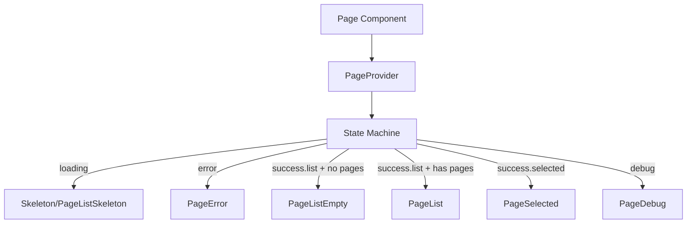
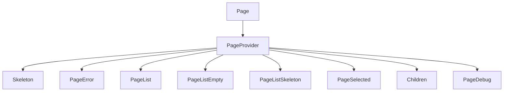
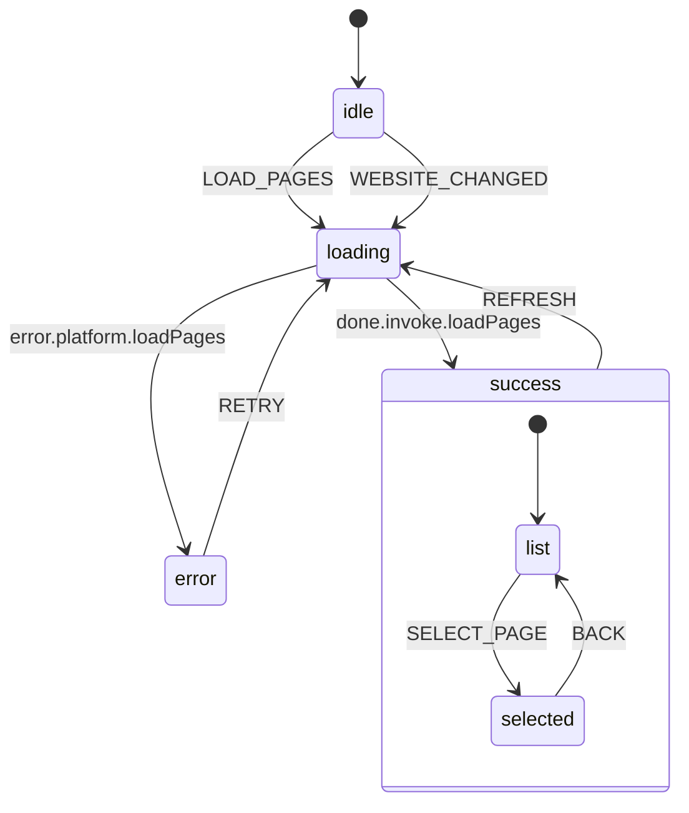
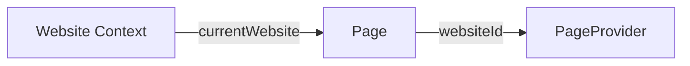
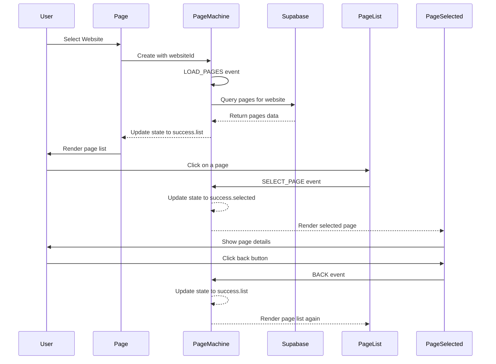
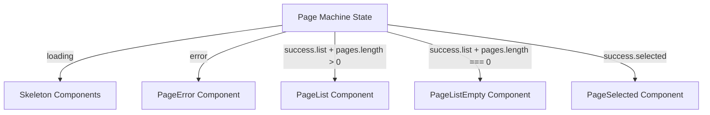

# Page Components

This directory contains components for managing and displaying pages associated with a website in the Ally Studio application.

## Architecture Overview

The page components follow a state machine architecture using XState. The components are structured to handle different states of the page data lifecycle (loading, success, error) and render appropriate UI for each state.



## Component Hierarchy

Each component is responsible for its own visibility based on the current state of the page machine:



## State Machine

The page machine manages the state of pages for a selected website. It handles loading pages, error states, and successful data fetching, as well as page selection.



## Component Responsibilities

### Page

The root component that sets up the machine and provider. It only renders when a website is selected.



### PageProvider

Provides the page machine context to all child components.

### PageList

Displays the list of pages when in the success.list state and there are pages to display. Allows selecting a page to view details.

### PageSelected

Displays the details of a selected page when in the success.selected state.

### PageListEmpty

Displays a message when in the success.list state but there are no pages.

### PageError

Displays an error message when in the error state.

### Skeleton & PageListSkeleton

Display loading indicators when in the loading or idle state.

### PageDebug

Displays debugging information about the current state of the page machine.

## Data Flow



## State Management

The page machine has the following states:

1. **idle**: Initial state before any pages are loaded
2. **loading**: Actively fetching pages from the database
3. **success**: Pages successfully loaded
   - **list**: Displaying the list of pages
   - **selected**: Displaying a selected page's details
4. **error**: An error occurred while loading pages

Each component checks the current state and only renders when appropriate:



## Usage

```tsx
// In a parent component
import { Page } from "@/components/page/page"

function WebsiteDetails() {
  return (
    <Page debug={process.env.NODE_ENV === "development"}>
      {/* Additional content that will be rendered inside PageSelected */}
    </Page>
  )
}
```

## Events

The page machine responds to the following events:

- **LOAD_PAGES**: Triggers loading of pages for the current website
- **REFRESH**: Refreshes the current list of pages
- **RETRY**: Retries loading pages after an error
- **WEBSITE_CHANGED**: Triggered when the selected website changes
- **SELECT_PAGE**: Selects a page to view its details
- **BACK**: Returns from the selected page to the page list

## Context

The page machine context contains:

- **websiteId**: ID of the current website
- **pages**: Array of page objects
- **selectedPage**: Currently selected page (or null if none selected)
- **error**: Error object if an error occurred
