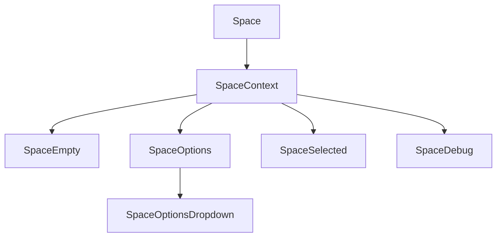
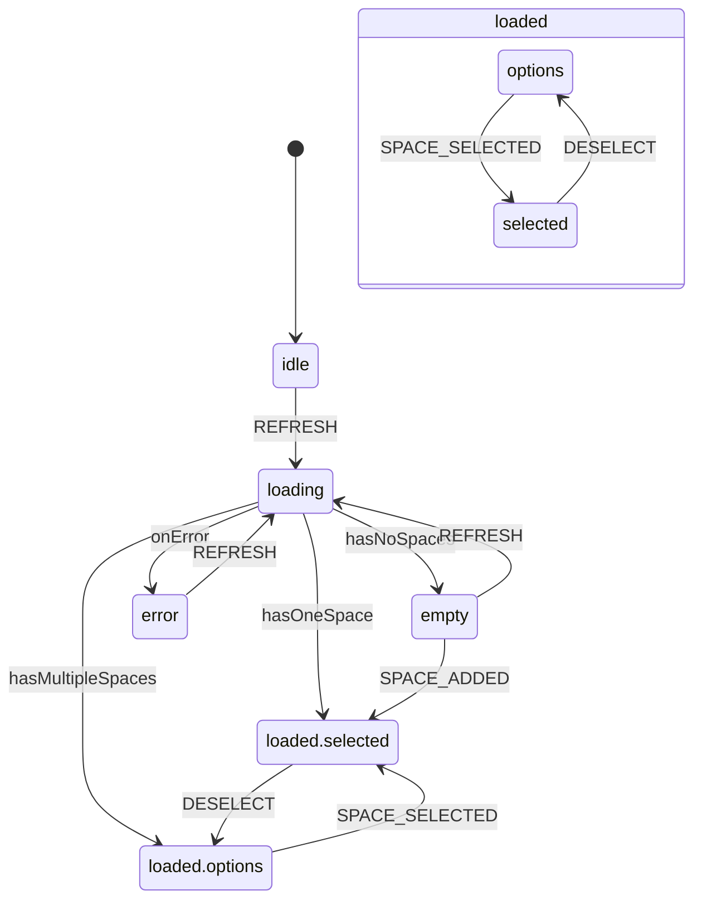

# Space Component System

This directory contains the components and state machine for managing spaces in AllyStudio. The system uses XState for state management and follows a component-based architecture where each component is responsible for rendering itself based on the current state.

## Architecture Overview

The space system follows a state-driven architecture with the following key components:

- **State Machine**: Manages the state transitions and business logic
- **Context Provider**: Provides the state machine to all child components
- **State-specific Components**: Render UI based on specific states
- **Orchestrator Component**: Composes all components together

## Component Structure



## State Machine Flow

The space machine manages the following states:



## Component Responsibilities

### `space-machine.ts`

Contains the XState state machine that manages the space selection flow. The machine handles:

- Loading spaces from the database
- Transitioning between states based on the number of spaces
- Managing the current space selection
- Handling errors during loading

### `space-context.tsx`

Provides the state machine actor to all child components using React Context. This allows components to:

- Access the current state
- Send events to the state machine
- Subscribe to state changes

### `space.tsx`

The main orchestrator component that composes all space-related components. It:

- Initializes the state machine
- Provides the context to child components
- Renders all state-specific components

### `space-empty.tsx`

Renders when no spaces are available. This component:

- Only displays when the state is "empty"
- Shows a card prompting the user to create a space

### `space-options.tsx`

Renders when multiple spaces are available and none is selected. This component:

- Only displays when the state is "loaded.options"
- Shows a list of available spaces
- Allows the user to select a space

### `space-selected.tsx`

Renders when a space is selected. This component:

- Only displays when the state is "loaded.selected"
- Shows the currently selected space
- Renders any child components (space content)

### `space-options-dropdown.tsx`

A dropdown component for selecting spaces. This component:

- Can be used within the SpaceSelected component
- Allows switching between spaces

### `space-debug.tsx`

A development component that shows the current state and context for debugging purposes.

## Usage Example

```tsx
// In a page or layout
import { Space } from "@/components/space/space"
import { YourContent } from "@/components/your-content"

export default function YourPage() {
  return (
    <Space>
      <YourContent />
    </Space>
  )
}
```

## State Transitions

1. **Initial Load**:

   - Starts in "idle" state
   - Automatically transitions to "loading"
   - Loads spaces from the database

2. **Empty State**:

   - If no spaces are found, transitions to "empty"
   - User can refresh or add a new space

3. **Multiple Spaces**:

   - If multiple spaces are found, transitions to "loaded.options"
   - User selects a space to work with

4. **Single Space**:

   - If only one space is found, automatically transitions to "loaded.selected"
   - The single space is automatically selected

5. **Space Selected**:

   - After selection, transitions to "loaded.selected"
   - Shows the selected space and renders children

6. **Error Handling**:
   - If an error occurs during loading, transitions to "error"
   - User can retry by refreshing

## Implementation Details

### State Checking Pattern

Components check if they should render using the `state.matches()` method:

```tsx
const shouldRender = useSelector(actor, (state) =>
  state.matches("empty") // or state.matches({ loaded: "options" })
)

if (!shouldRender) {
  return null
}
```

### Event Handling

Components send events to the state machine using the `send` method:

```tsx
actor.send({ type: "SPACE_SELECTED", space })
```

### Context Access

Components access the state machine context using selectors:

```tsx
const spaces = useSelector(actor, (state) => state.context.spaces)
```

## Best Practices

1. **State-Driven Rendering**: Components should only render when in the appropriate state
2. **Single Responsibility**: Each component should handle one specific state
3. **Centralized Logic**: Business logic should be in the state machine, not components
4. **Minimal Props**: Avoid passing props between components, use the context instead
5. **Type Safety**: Use TypeScript to ensure type safety for events and context
