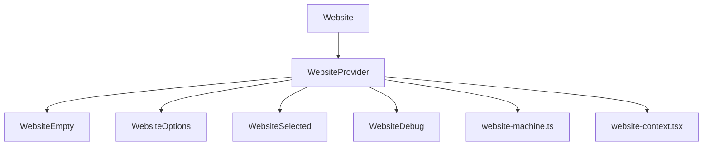

# Website Component Architecture

This directory contains a set of components that implement a state machine-based architecture for managing websites within a space. The architecture follows the same pattern as the space components, providing a consistent approach to state management across the application.

## Component Structure



## State Machine Flow

```mermaid
stateDiagram-v2
    [*] --> loading
    loading --> error: Error loading websites
    loading --> empty: No websites found
    loading --> loaded: Websites loaded

    error --> loading: REFRESH

    empty --> loading: REFRESH
    empty --> adding: ADD_WEBSITE

    loaded --> loading: REFRESH
    loaded --> adding: ADD_WEBSITE

    state loaded {
        [*] --> options
        options --> selected: WEBSITE_SELECTED
        selected --> selected: WEBSITE_SELECTED
    }

    adding --> error: Error adding website
    adding --> loaded.selected: Website added successfully

    state "*" {
        -- --> loading: SPACE_CHANGED
    }
```

## Components

### `website-machine.ts`

The core state machine that manages the website state. It handles loading websites, selecting a website, adding new websites, and handling errors. The machine includes the following states:

- `loading`: Fetching websites from the database
- `error`: An error occurred while loading or adding websites
- `empty`: No websites found
- `loaded`: Websites are loaded, with substates:
  - `options`: Showing a list of websites to select
  - `selected`: A website is selected
- `adding`: Adding a new website

### `website-context.tsx`

Provides the context for the website state machine. It creates an actor from the machine and provides it to child components through React context.

### `website.tsx`

The main component that orchestrates the rendering of all other components based on the current state. It uses the `WebsiteProvider` to provide the state machine context to all child components.

### `website-empty.tsx`

Renders when there are no websites in the current space. Provides a form to add a new website.

### `website-options.tsx`

Renders a list of websites to select from when in the `loaded.options` state. Also provides a form to add a new website.

### `website-selected.tsx`

Renders when a website is selected, showing details about the selected website and providing actions like visiting the website or changing the selection.

### `website-debug.tsx`

A debug component that shows the current state and context of the website machine. Only visible in development mode.

## Usage Example

```tsx
import { Website } from "@/components/website/website"

export default function WebsitePage() {
  return (
    <div>
      <h1>Website Management</h1>
      <Website spaceId="space-123" debug={true}>
        {/* Child components rendered when a website is selected */}
        <div>Website-specific content goes here</div>
      </Website>
    </div>
  )
}
```

## State Transitions

The website machine handles the following events:

- `REFRESH`: Reload websites from the database
- `ADD_WEBSITE`: Add a new website
- `WEBSITE_SELECTED`: Select a website
- `URL_CHANGED`: Update the current URL
- `SPACE_CHANGED`: Change the current space

## Implementation Details

### State Checking Pattern

Each component checks if it should render based on the current state:

```tsx
const shouldRender = useSelector(
  actor,
  (state) => state.matches({ loaded: "options" }),
  Object.is
)

if (!shouldRender) {
  return null
}
```

### Event Handling

Events are sent to the machine using the actor's `send` method:

```tsx
const handleSelect = useCallback(
  (website: Website) => {
    actor.send({ type: "WEBSITE_SELECTED", website })
  },
  [actor]
)
```

### Context Access

Components access the machine's context using selectors:

```tsx
const website = useSelector(
  actor,
  (state) => state.context.currentWebsite,
  Object.is
)
```

## Best Practices

1. **Use memoized selectors**: Always use `Object.is` comparison with `useSelector` to prevent unnecessary re-renders.
2. **Use memo for components**: Wrap components with `memo` to prevent unnecessary re-renders.
3. **Use useCallback for event handlers**: Memoize event handlers to prevent unnecessary recreations.
4. **Check state before rendering**: Each component should check if it should render based on the current state.
5. **Provide clear aria attributes**: Ensure all components are accessible with proper aria attributes.
6. **Hide decorative icons**: Use `aria-hidden="true"` for decorative icons.
7. **Use sr-only for screen reader text**: Provide additional context for screen readers using `sr-only` classes.
8. **Use proper semantic HTML**: Use appropriate HTML elements for the content.
