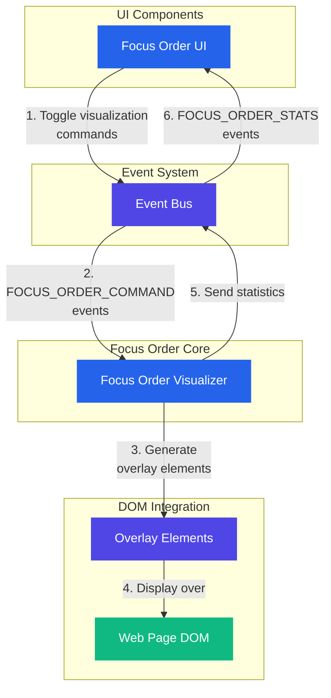

# Focus Order Visualizer

A tool for visualizing the tab order of interactive elements on a webpage, helping identify logical navigation issues for keyboard users.

## Features

- **Numbered Indicators**: Shows the exact tab sequence with numbered badges
- **Connecting Lines**: Visualizes the path between sequential focus elements
- **Positive TabIndex Warning**: Highlights elements with positive tabindex values
- **Interactive UI**: Toggle visualization on/off with a simple button
- **Statistics**: Shows the total number of focusable elements and potential issues
- **Performance Optimized**: Minimal DOM manipulation for smooth performance
- **Extension Framework Compatibility**: Works seamlessly with browser extensions

## Architecture

The Focus Order Visualizer is built with a simple, efficient architecture:

- `focus-order.ts`: Core module that handles focus order detection and visualization
- `focus-order.tsx`: React component for UI controls

### Architecture Diagram



### Flow Explanation

1. **User Interaction**: The user interacts with the Focus Order UI component, toggling the visualization feature.

2. **Command Dispatch**: The UI component dispatches FOCUS_ORDER_COMMAND events through the Event Bus.

3. **Element Detection**: The Focus Order Visualizer identifies all focusable elements on the page.

4. **Overlay Creation**: Numbered indicators and connecting lines are created as overlay elements.

5. **Statistics Generation**: Information about the focus order is collected and sent back to the UI.

6. **Visualization**: The overlays are displayed on top of the page, showing the tab sequence.

7. **Toggling**: The visualization can be toggled on/off, with the overlays being added or removed from the DOM.

## Usage

### Basic Usage

```typescript
import { initialize } from "@/lib/focus-order/focus-order"

// Initialize the focus order visualizer
initialize()

// The visualizer will listen for commands from the event bus
```

### Manual Control

```typescript
import {
  startVisualizingFocusOrder,
  stopVisualizingFocusOrder,
  toggleFocusOrderVisualization
} from "@/lib/focus-order/focus-order"

// Start visualization
startVisualizingFocusOrder()

// Stop visualization
stopVisualizingFocusOrder()

// Toggle visualization
toggleFocusOrderVisualization()

// Check current state
const isActive = getFocusOrderVisualizationState()
```

## Focus Order Detection

The visualizer detects focusable elements using a comprehensive set of selectors:

1. Links and areas with href attributes
2. Form controls (inputs, selects, textareas, buttons)
3. Elements with tabindex attributes
4. Interactive elements (details/summary, audio/video with controls)
5. Contenteditable elements

Elements are sorted according to the tab order specification:

1. Elements with positive tabindex values, in ascending order
2. Elements with tabindex="0" or naturally focusable elements, in DOM order

## Event Bus Integration

The visualizer integrates with the application's event bus:

1. Listens for FOCUS_ORDER_COMMAND events
2. Responds to start, stop, and toggle commands
3. Publishes FOCUS_ORDER_STATS events with information about the focus order

Supported commands:

- `start`: Start visualizing focus order
- `stop`: Stop visualizing focus order
- `toggle`: Toggle visualization state

## Accessibility Considerations

The Focus Order Visualizer helps identify several common accessibility issues:

1. **Illogical Tab Order**: When the visual order doesn't match the tab order
2. **Positive TabIndex**: Using positive tabindex values (which should generally be avoided)
3. **Keyboard Traps**: Elements that might trap keyboard focus
4. **Missing Focus Indicators**: Elements that are focusable but don't show focus styles

## Inspiration

This tool is inspired by the [WCAG 2.1 Success Criterion 2.4.3: Focus Order](https://www.w3.org/WAI/WCAG21/Understanding/focus-order.html), which requires that components receive focus in an order that preserves meaning and operability.
