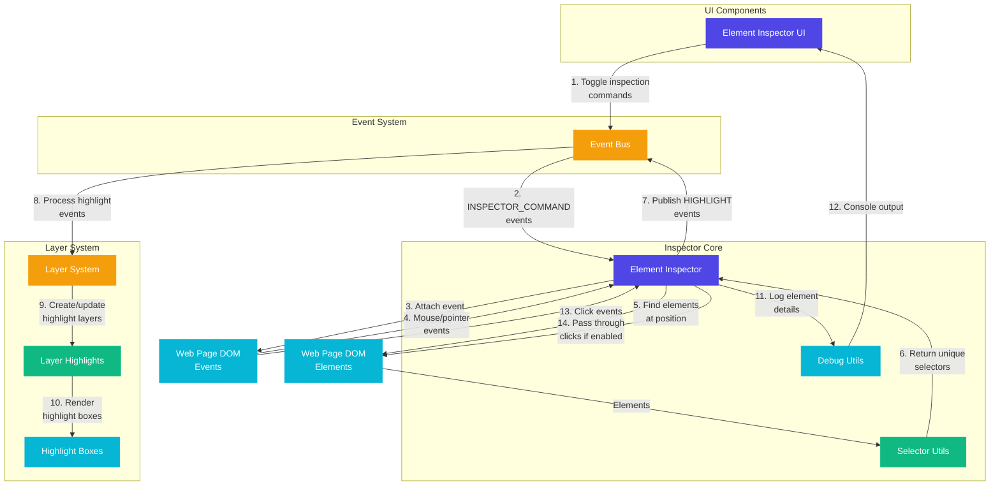

# Element Inspector

A high-performance, modular element inspector for web accessibility testing.

## Features

- **Layer System Integration**: Uses the application's layer system for highlighting elements
- **Deep Inspection Mode**: Targets the smallest visible element at each position
- **Click-Through Mode**: Interact with elements underneath while inspecting
- **Debug Mode**: Detailed console logging and element reference inspection
- **Modular Architecture**: Easily extensible and maintainable
- **Extension Framework Compatibility**: Automatically ignores browser extension components (Plasmo)

## Architecture

The Element Inspector is built with a modular architecture, consisting of several core modules:

- `element-inspector.ts`: Main module that handles inspection logic and event handling
- `selector-utils.ts`: Utilities for generating unique selectors and XPaths
- `debug-utils.ts`: Debug logging and visualization tools

### Architecture Diagram



### Flow Explanation

1. **User Interaction**: The user interacts with the Element Inspector UI component, toggling inspection, debug mode, deep inspection, or click-through mode.

2. **Command Dispatch**: The UI component dispatches INSPECTOR_COMMAND events through the Event Bus.

3. **Inspection Initialization**: The Element Inspector attaches event listeners to the DOM when inspection starts.

4. **Element Detection**: As the user moves their cursor, pointer events are captured and processed by the Element Inspector.

5. **Selector Generation**: When an element is detected, the Selector Utils generate a unique selector for the element.

6. **Highlight Publishing**: The Element Inspector publishes HIGHLIGHT events to the Event Bus.

7. **Layer System Processing**: The Layer System receives these events and creates or updates highlight layers.

8. **Highlight Rendering**: The Layer System renders highlight boxes around the selected elements.

9. **Debug Information**: If debug mode is enabled, detailed element information is logged to the console.

10. **Click-Through Behavior**: If click-through mode is enabled, clicks are passed through to the underlying elements.

## Usage

### Basic Usage

```typescript
import { initialize } from "@/lib/inspector/element-inspector"

// Initialize the inspector
initialize()

// The inspector will listen for commands from the event bus
```

### Using Selector Utilities

```typescript
import { getUniqueSelector } from "@/lib/utils/selector-utils"

// Generate a unique selector for an element
const selector = getUniqueSelector(element)
```

## Selector Generation

The inspector uses a multi-tiered approach for generating selectors:

1. ID-based selectors (if the element has an ID)
2. Class-based selectors with structural context
3. Attribute-based selectors
4. XPath as a fallback for complex cases

## Layer System Integration

The Element Inspector now uses the application's layer system for highlighting elements:

1. When an element is selected, the inspector publishes a HIGHLIGHT event to the event bus
2. The layer system receives this event and creates/updates the highlight box
3. This eliminates duplicate highlight boxes and ensures consistent styling

Benefits of this approach:

- Single source of truth for highlights
- Consistent styling across the application
- Better performance by avoiding duplicate DOM elements
- Centralized management of highlight layers

## Extension Framework Compatibility

The Element Inspector is designed to work seamlessly with browser extensions:

1. Automatically ignores Plasmo components (`plasmo-*` elements)
2. When a Plasmo component is detected, the inspector finds the closest non-Plasmo parent element
3. Excludes Plasmo components from deep inspection mode
4. This prevents unnecessary highlighting of extension framework elements

## Deep Inspection Mode

Deep inspection mode targets the smallest visible elements at a position:

1. When enabled, the inspector uses `findDeepestElementAtPoint` to find the most specific element
2. This is useful for inspecting complex layouts with many nested elements

## Click-Through Mode

Click-through mode allows interaction with underlying elements while inspecting:

1. When enabled, clicks pass through to the underlying elements
2. When disabled, clicks are captured by the inspector to prevent accidental navigation

## Debug Mode

Debug mode provides detailed information about inspected elements:

1. Logs clickable element references to the console
2. Shows selector information and element properties
3. Provides visibility checks for elements

## Event Bus Integration

The inspector integrates with the application's event bus:

1. Listens for INSPECTOR_COMMAND events
2. Publishes HIGHLIGHT events

Supported commands:

- `start`: Start inspection
- `stop`: Stop inspection
- `toggleDebug`: Toggle debug mode
- `toggleDeepInspection`: Toggle deep inspection mode
- `toggleClickThrough`: Toggle click-through mode
