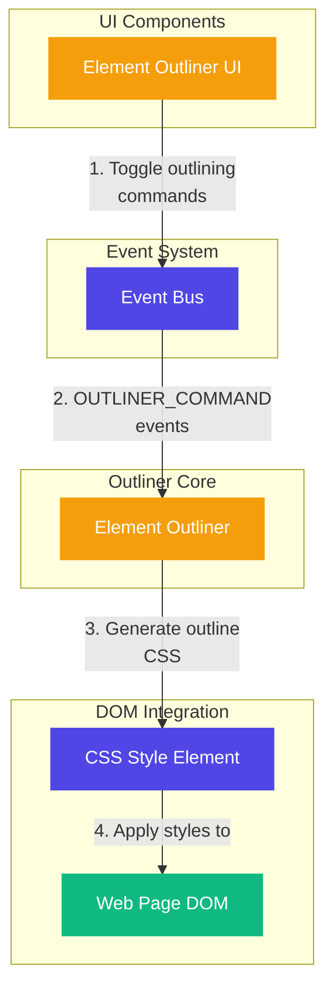

# Element Outliner

A lightweight, high-performance element outliner for visualizing HTML structure, inspired by the Pesticide Chrome extension.

## Features

- **Colored Outlines**: Applies distinct colored outlines to different HTML elements
- **Hover Effects**: Enhanced visualization with hover effects
- **Toggle Control**: Easy to enable/disable via UI or event bus
- **Performance Optimized**: Minimal DOM manipulation for smooth performance
- **Extension Framework Compatibility**: Works seamlessly with browser extensions

## Architecture

The Element Outliner is built with a simple, efficient architecture:

- `element-outliner.ts`: Core module that handles outline generation and toggling
- `element-outliner.tsx`: React component for UI controls

### Architecture Diagram



### Flow Explanation

1. **User Interaction**: The user interacts with the Element Outliner UI component, toggling the outlining feature.

2. **Command Dispatch**: The UI component dispatches OUTLINER_COMMAND events through the Event Bus.

3. **CSS Generation**: The Element Outliner generates CSS rules for outlining different HTML elements with distinct colors.

4. **Style Application**: The generated CSS is applied to the page through a dynamically created style element.

5. **Toggling**: The outlining can be toggled on/off, with the style element being added or removed from the DOM.

## Usage

### Basic Usage

```typescript
import { initialize } from "@/lib/outliner/element-outliner"

// Initialize the outliner
initialize()

// The outliner will listen for commands from the event bus
```

### Manual Control

```typescript
import {
  startOutlining,
  stopOutlining,
  toggleOutlining
} from "@/lib/outliner/element-outliner"

// Start outlining
startOutlining()

// Stop outlining
stopOutlining()

// Toggle outlining
toggleOutlining()

// Check current state
const isActive = getOutliningState()
```

## CSS Generation

The outliner generates CSS rules for different HTML elements:

1. Each element type gets a unique outline color
2. Hover effects are added for better visualization
3. Special handling ensures highlight boxes aren't affected

## Event Bus Integration

The outliner integrates with the application's event bus:

1. Listens for OUTLINER_COMMAND events
2. Responds to start, stop, and toggle commands

Supported commands:

- `start`: Start outlining
- `stop`: Stop outlining
- `toggle`: Toggle outlining state

## Inspiration

This tool is inspired by the [Pesticide Chrome extension](https://github.com/mrmrs/pesticide) by Adam Morse (mrmrs), which provides a similar outlining functionality for web development.
