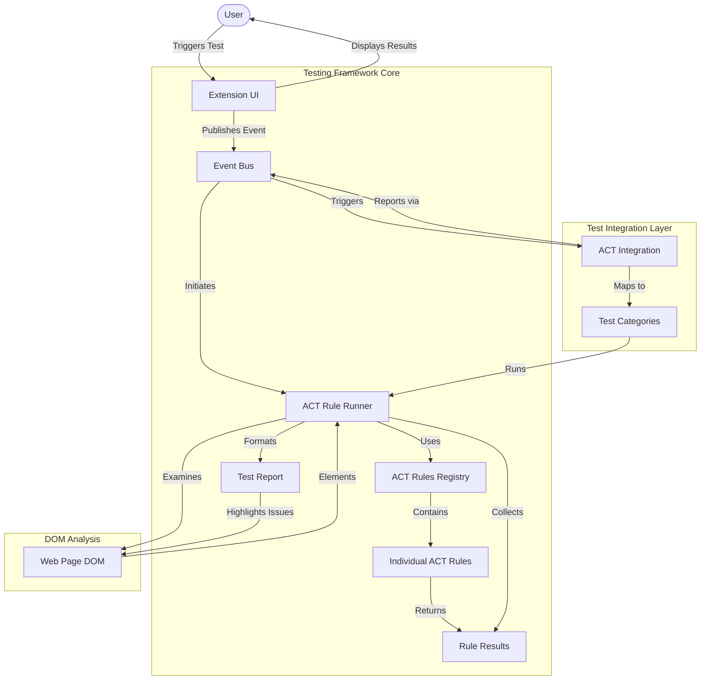

# AllyStudio Testing Framework

## Overview

The AllyStudio Testing Framework provides a robust system for automated accessibility testing of web pages based on WCAG (Web Content Accessibility Guidelines) and ACT (Accessibility Conformance Testing) methodology. It enables the AllyStudio extension to detect accessibility issues in real-time and provide actionable feedback to users.

## System Architecture

The testing framework follows a modular architecture focused on the ACT Rules Format 1.0, allowing for standardized accessibility testing:



## Core Components

### ACT Types (`act-types.ts`)

Defines the core type system for accessibility testing:

- `ACTOutcome`: Possible test outcomes ("passed", "failed", "inapplicable", "cantTell")
- `ACTSeverity`: Issue severity levels
- `WCAGLevel`: WCAG conformance levels (A, AA, AAA)
- Result and report interfaces for structured data

### ACT Rules Registry (`act-rules-registry.ts`)

Central repository for all accessibility test rules:

- Manages registration and retrieval of rules
- Categorizes rules by WCAG criteria and test type
- Provides helper functions for rule creation
- Implements rule applicability testing

### ACT Rule Runner (`act-rule-runner.ts`)

Executes accessibility tests and collects results:

- Manages rule execution with timeouts
- Collects and organizes test results
- Generates standardized test reports
- Prevents duplicate rule execution

### ACT Test Runner (`act-test-runner.ts`)

Higher-level test execution engine:

- Manages suites of tests
- Tracks test progress
- Provides UI feedback via element highlighting
- Handles test abortion and error recovery

### Integration Layer (`act-integration.ts`)

Maps between test types and ACT rules:

- Connects user-facing test types to rule categories
- Manages test execution flow
- Publishes test completion events
- Formats and aggregates results for UI consumption

### Test Configuration (`test-config.ts`)

Configures all available test types:

- Maps test types to display names
- Defines UI text and interaction patterns
- Configures visualization layers

## Rule Implementation Structure

Rules are organized by test category:

1. Each rule implements the `ACTRule` interface
2. Rules are registered with the registry at runtime
3. Rules define applicability and execution logic
4. Rules are tied to specific WCAG success criteria

Example rule implementation:

```typescript
// From image-accessible-name.ts
const imageAccessibleNameRule = createACTRule(
  "image-has-accessible-name",
  "Images must have an accessible name",
  "This rule checks that all image elements have an accessible name.",
  {
    accessibility_requirements: getWCAGReference("1.1.1"),
    categories: [ACTRuleCategory.IMAGES],
    implementation_url:
      "https://www.w3.org/WAI/WCAG21/Understanding/non-text-content.html",

    isApplicable: () => {
      const images = document.querySelectorAll(
        'img:not([role="presentation"]):not([role="none"]), [role="img"]'
      )
      return images.length > 0
    },

    execute: async () => {
      // Implementation details...
    }
  }
)
```

## Migration Status

The framework was migrated from a type-specific event system to a generic ACT-based approach:

- ✅ Migration to generic events completed
- ✅ Headings tests migrated to ACT rules
- ✅ Links tests migrated to ACT rules
- ✅ Alt text tests migrated to ACT rules
- ✅ Interactive elements tests migrated to ACT rules
- ✅ Other test types migrated to ACT rules
- ✅ Legacy code paths removed

All tests now use the standardized ACT rule format, providing consistent reporting and better mapping to WCAG criteria.

## Test Execution Flow

1. User initiates a test (e.g., "Check Headings")
2. UI component publishes a test request event
3. ACT integration layer receives the event
4. Integration layer maps the test type to ACT rule categories
5. ACT Rule Runner executes the applicable rules
6. Results are collected and formatted
7. Test completion event is published with results
8. UI displays results and highlights issues on the page

## WCAG Coverage Plan

The framework is implementing comprehensive WCAG 2.1 coverage following the POUR principles:

1. **Perceivable**:

   - Text alternatives (1.1.1) - Implemented
   - Time-based media (1.2.x) - Planned
   - Adaptable (1.3.x) - Partially implemented
   - Distinguishable (1.4.x) - Partially implemented

2. **Operable**:

   - Keyboard accessible (2.1.x) - Partially implemented
   - Enough time (2.2.x) - Planned
   - Seizures (2.3.x) - Planned
   - Navigable (2.4.x) - Partially implemented
   - Input modalities (2.5.x) - Planned

3. **Understandable**:

   - Readable (3.1.x) - Partially implemented
   - Predictable (3.2.x) - Planned
   - Input assistance (3.3.x) - Planned

4. **Robust**:
   - Compatible (4.1.x) - Partially implemented

## Adding New Tests

To implement a new ACT rule:

1. Create a new rule file in `rules/[category]/[rule-name].ts`
2. Implement the rule using the `createACTRule` helper
3. Register the rule in the appropriate category file
4. Update the registration in `rules/index.ts`
5. Ensure the rule is properly categorized for test integration

## Test Result Structure

Results follow the standard ACT Results format:

```typescript
interface ACTRuleResult {
  rule: {
    id: string
    name: string
  }
  outcome: ACTOutcome
  element?: {
    selector: string
    html: string
    xpath?: string
    attributes?: Record<string, string>
  }
  message: string
  remediation?: string
  impact?: ACTSeverity
  wcagCriteria?: string[]
  helpUrl?: string
}
```

## Future Improvements

1. **Performance Optimization**:

   - Implement more efficient element selection
   - Add caching for expensive computations
   - Improve rule applicability checking

2. **Rule Coverage Expansion**:

   - Complete implementation of all WCAG 2.1 success criteria
   - Add WAI-ARIA best practices
   - Implement WCAG 2.2 new success criteria

3. **Result Enhancement**:

   - Add more detailed remediation guidance
   - Improve issue localization
   - Enhance visualization of complex issues

4. **Testing and Validation**:
   - Add unit tests for all rules
   - Validate against known accessibility issues
   - Create test pages for rule verification

## References and Resources

- [W3C ACT Rules Format](https://www.w3.org/TR/act-rules-format/)
- [WCAG 2.1 Success Criteria](https://www.w3.org/TR/WCAG21/)
- [WAI-ARIA Authoring Practices](https://www.w3.org/WAI/ARIA/apg/)
- [Axe-core Implementation](https://github.com/dequelabs/axe-core)
