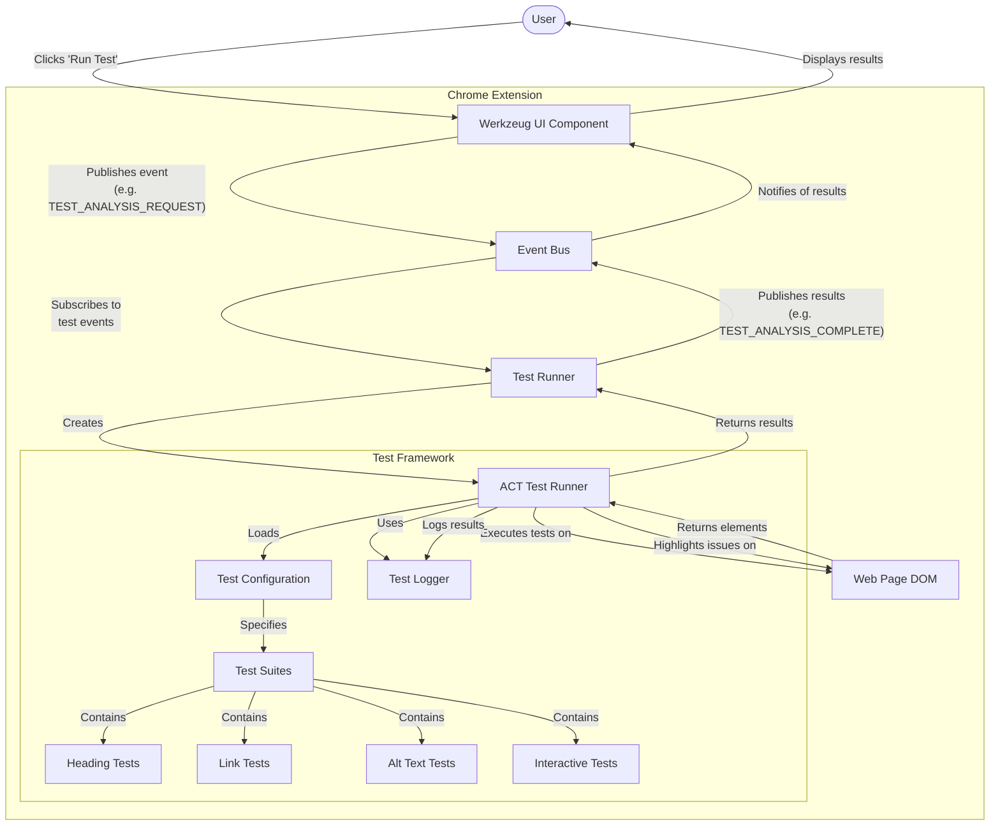

# AllyStudio Testing Framework

## Overview

The AllyStudio Testing Framework provides a robust system for automated accessibility testing of web pages. It enables the extension to detect accessibility issues in real-time and provide actionable feedback to users.

## System Architecture

The following diagram illustrates how the testing framework components interact:

## Core Components

### `act-test-runner.ts`

- **Purpose**: Central test execution engine
- **Key features**:
  - `ACTTestRunner` class that runs accessibility tests on web pages
  - Utilities for finding elements, executing tests, and reporting results
  - Handles test progress reporting and test cancellation
  - Manages element highlighting on the page
- **Integration**: Used by `create-test-runner.ts` to expose a simplified API

### `act-test-suite.ts`

- **Purpose**: Defines the structure for test suites and test cases
- **Key features**:
  - Provides a fluent API for defining tests with `suite()`, `describe()`, and `test()` functions
  - Manages test contexts and execution
  - Supports async test evaluation
- **Integration**: Used by test suites in the `suites` directory

### `test-config.ts`

- **Purpose**: Configuration for different test types
- **Key features**:
  - Defines four test types: headings, links, alt text, interactive elements
  - Provides display text for UI components
  - Maps test types to layer names
- **Integration**: Used by both UI and test runner components

### `test-logger.ts`

- **Purpose**: Logging test results and diagnostics
- **Integration**: Used by the test runner to track progress and outcomes

### `create-test-runner.ts`

- **Purpose**: Creates a simplified interface to the test runner
- **Key features**:
  - Handles event subscription and result publication
  - Maps between internal test results and external event formats
- **Integration**: Used by `test-runner.ts` in the content script

## Test Suites

The framework includes four main test categories:

1. **Heading Structure** (`structure/heading-tests.ts`)

   - Tests for proper heading hierarchy
   - Checks for accessible names
   - Evaluates heading structure semantics

2. **Link Accessibility** (`accessibility/link-tests.ts`)

   - Tests for proper link text
   - Checks for accessible names
   - Evaluates link functionality

3. **Alt Text Analysis** (`media/alt-tests.ts`)

   - Tests for presence of alt text on images
   - Evaluates quality of alt text
   - Checks for decorative image handling

4. **Interactive Elements** (`interaction/interactive-tests.ts`)
   - Tests for keyboard accessibility
   - Evaluates ARIA roles and properties
   - Checks focus management

## Event System

### Generic Event Model

AllyStudio uses a generic event system for standardized test execution and result handling:

- **`TEST_ANALYSIS_REQUEST`** - Used to request that a test be run
- **`TEST_ANALYSIS_COMPLETE`** - Used to indicate that a test has finished

This system simplifies the codebase, makes it easier to add new test types, and reduces the amount of duplicate code.

### Event Migration Background

Prior to the current implementation, AllyStudio used specific event types for each test type:

- `HEADING_ANALYSIS_COMPLETE`
- `LINK_ANALYSIS_COMPLETE`
- `ALT_ANALYSIS_COMPLETE`
- `INTERACTIVE_ANALYSIS_COMPLETE`

These have been replaced with the generic events that work with all test types.

### Key Migration Changes

1. **Updated TestConfig**

   - Removed specific event references
   - Made `layerName` a required property for better UI integration

2. **Simplified Event Types**

   - Removed specific event types and interfaces
   - Kept the issue type definitions for reference

3. **Updated Event Publishing**

   - `createTestRunner` now only publishes generic events
   - `publishTestComplete` only publishes the generic event

4. **Updated UI Components**

   - UI now only uses generic events
   - Added fallback completion logic for reliability
   - Improved error handling and logging

5. **Content Script Integration**
   - Content scripts use generic events
   - Simplified test completion tracking

## Safety Features

Several safety features are implemented in the framework:

1. **Fallback Completion Events**

   - If the content script doesn't respond, a fallback completion event is published
   - Added a 3 second timeout to prevent UI from getting stuck

2. **Tab Status Checking**

   - Added checks to ensure the tab is ready to receive messages
   - Provides early feedback if communication might fail

3. **Error Handling**
   - Every potential error is caught and logged
   - Ensures a completion event is always published, even on error

## Integration Points

### Chrome Extension Integration

- The framework runs within a Chrome extension built with Plasmo
- `contents/test-runner.ts` initializes the test runner in the extension content script
- Tests are executed in the context of the current web page

### UI Component Integration

- `components/werkzeug.tsx` provides the UI for:
  - Test selection and execution
  - Progress tracking
  - Result visualization
  - Issue highlighting controls

### Event-based Communication

- Uses an event bus (`lib/events/event-bus.ts`) for communication
- Event types include:
  - Test requests (e.g., `TEST_ANALYSIS_REQUEST`)
  - Test results (e.g., `TEST_ANALYSIS_COMPLETE`)
  - UI updates (e.g., `HIGHLIGHT_ELEMENT`, `CLEAR_HIGHLIGHTS`)
- Optimized for performance with direct handlers for high-priority events

## User Flow

1. User opens the AllyStudio extension on a web page
2. User selects a test type in the Werkzeug UI
3. UI dispatches a test request event
4. Content script's test runner receives the event and runs tests
5. Test results are published as events
6. UI displays results and highlights issues on the page
7. User can click on issues to see details and fix recommendations

## Future Improvements

1. **Issue Type Consolidation**

   - Create a unified issue type instead of separate types for each test
   - Further simplify the codebase and make it easier to process issues generically

2. **Automatic Test Discovery**

   - Use a registry approach to auto-register new tests
   - Further reduce the need for changes when adding new tests

3. **Event Documentation**
   - Create comprehensive documentation of the event system
   - Make it easier for new developers to understand the system

## Adding New Tests

To add a new test type:

1. Create a new test file in the appropriate suite category
2. Update `test-config.ts` to include the new test type
3. Ensure the UI components handle the new test type appropriately
4. Add the new test type to relevant event handling code

## Best Practices

When working with the testing framework:

1. **Use Generic Events** - Utilize the standardized event system for communication
2. **Provide Test ID** - Always include the testId in events for proper routing
3. **Handle Errors** - Always include error handling in test functions
4. **Avoid Side Effects** - Tests should not modify the DOM
5. **Check Abort Signals** - Always check abort signals for long-running tests
6. **Documentation** - Add clear documentation about what each test checks
7. **Include Severity** - Correctly categorize severity of each issue
