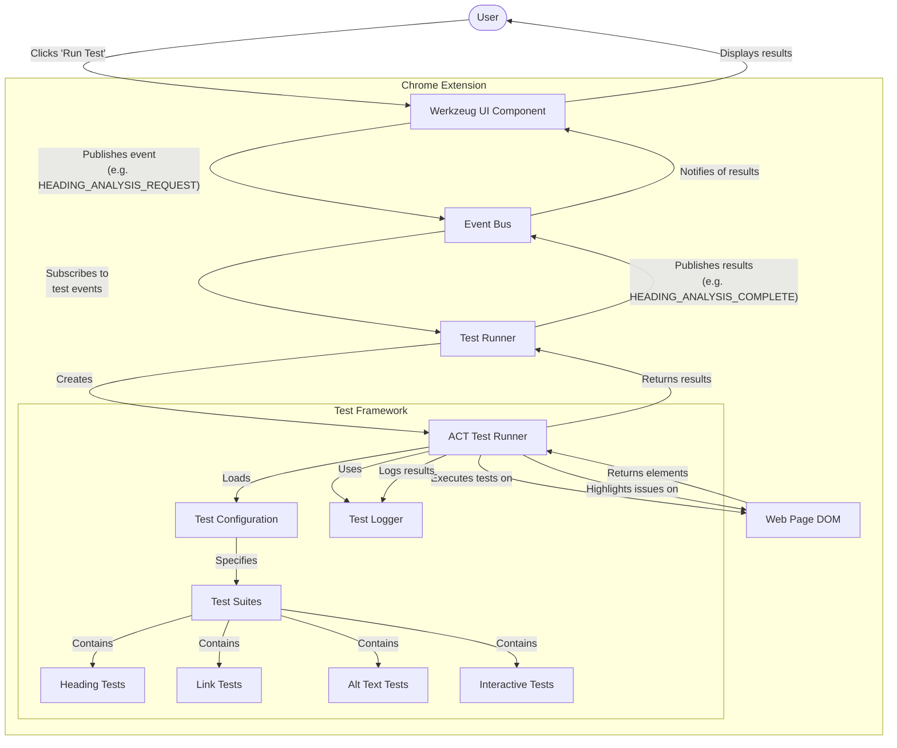

# Allyship.dev Testing Framework Analysis

## Overview

This document provides an analysis of the testing framework in the Allyship.dev project, specifically in the `apps/allystudio/src/lib/testing` directory. The framework is designed for accessibility testing of web pages and is integrated into a Chrome extension using Plasmo.

## System Architecture

The following diagram illustrates how the testing framework components interact:

## Core Components

### `act-test-runner.ts`

- **Status**: Actively used
- **Purpose**: Central test execution engine
- **Key features**:
  - `ACTTestRunner` class that runs accessibility tests on web pages
  - Utilities for finding elements, executing tests, and reporting results
  - Handles test progress reporting and test cancellation
  - Manages element highlighting on the page
- **Integration**: Used by `create-test-runner.ts` to expose a simplified API

### `act-test-suite.ts`

- **Status**: Actively used
- **Purpose**: Defines the structure for test suites and test cases
- **Key features**:
  - Provides a fluent API for defining tests with `suite()`, `describe()`, and `test()` functions
  - Manages test contexts and execution
  - Supports async test evaluation
- **Integration**: Used by test suites in the `suites` directory

### `test-config.ts`

- **Status**: Actively used
- **Purpose**: Configuration for different test types
- **Key features**:
  - Defines four test types: headings, links, alt text, interactive elements
  - Maps test types to their corresponding event names
  - Provides display text for UI components
- **Integration**: Used by both UI and test runner components

### `test-logger.ts`

- **Status**: Actively used
- **Purpose**: Logging test results and diagnostics
- **Integration**: Used by the test runner to track progress and outcomes

### `create-test-runner.ts`

- **Status**: Actively used
- **Purpose**: Creates a simplified interface to the test runner
- **Key features**:
  - Handles event subscription and result publication
  - Maps between internal test results and external event formats
- **Integration**: Used by `test-runner.ts` in the content script

## Test Suites

The framework includes four main test categories:

1. **Heading Structure** (`structure/heading-tests.ts`)

   - Tests for proper heading hierarchy
   - Checks for accessible names
   - Evaluates heading structure semantics

2. **Link Accessibility** (`accessibility/link-tests.ts`)

   - Tests for proper link text
   - Checks for accessible names
   - Evaluates link functionality

3. **Alt Text Analysis** (`media/alt-tests.ts`)

   - Tests for presence of alt text on images
   - Evaluates quality of alt text
   - Checks for decorative image handling

4. **Interactive Elements** (`interaction/interactive-tests.ts`)
   - Tests for keyboard accessibility
   - Evaluates ARIA roles and properties
   - Checks focus management

## Integration Points

### Chrome Extension Integration

- The framework runs within a Chrome extension built with Plasmo
- `contents/test-runner.ts` initializes the test runner in the extension content script
- Tests are executed in the context of the current web page

### UI Component Integration

- `components/werkzeug.tsx` provides the UI for:
  - Test selection and execution
  - Progress tracking
  - Result visualization
  - Issue highlighting controls

### Event-based Communication

- Uses an event bus (`lib/events/event-bus.ts`) for communication
- Event types include:
  - Test requests (e.g., `HEADING_ANALYSIS_REQUEST`)
  - Test results (e.g., `HEADING_ANALYSIS_COMPLETE`)
  - UI updates (e.g., `HIGHLIGHT`)
- Optimized for performance with direct handlers for high-priority events

## User Flow

1. User opens the AllyStudio extension on a web page
2. User selects a test type in the Werkzeug UI
3. UI dispatches a test request event
4. Content script's test runner receives the event and runs tests
5. Test results are published as events
6. UI displays results and highlights issues on the page
7. User can click on issues to see details and fix recommendations

## Current Usage Status

All components in the testing framework are actively used and form a central feature of the AllyStudio application. The framework follows a modular design with well-defined responsibilities, making it maintainable and extensible.

## Recommendations

The testing framework appears well-structured and actively used. Any future extensions should follow the existing patterns:

1. Add new test suites by creating a new file in the appropriate suite category
2. Update `test-config.ts` to include the new test type
3. Ensure the UI components handle the new test type appropriately
4. Add event types for the new test in the event system

## Conclusion

The testing framework in the Allyship.dev project provides a robust system for accessibility testing in a Chrome extension context. The code is well-organized, actively used, and integrated with both the extension infrastructure and UI components.
