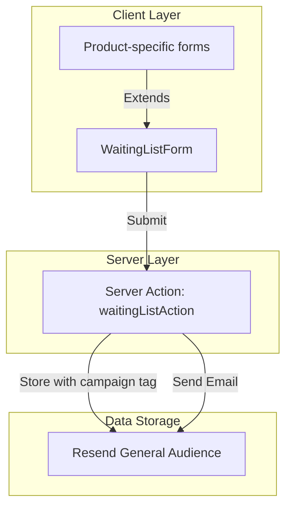

# Waiting List Architecture

This document outlines the minimalist architecture of the waiting list subscription system for the Allyship platform.

## System Overview

The waiting list system collects email addresses for upcoming products. The system uses Resend for both subscriber storage and email sending, with a single audience for all subscribers.



## Key Components

### 1. Form Components
- `WaitingListForm.tsx` - The generic form component for collecting email addresses
- Product-specific implementations (e.g., `WhiteLabelLeadForm`) - Extensions of the base form

### 2. Server Action
- `waiting-list-action.tsx` - Server action for handling form submissions

### 3. Data Storage
- Single Resend audience - Stores all subscribers with campaign data in firstName field

## Implementation

### 1. Generic Form Component
```tsx
interface WaitingListFormProps {
  campaign: string;
  title: string;
  description: string;
  preview?: React.ReactNode;
}

export function WaitingListForm({
  campaign,
  title,
  description,
  preview
}: WaitingListFormProps) {
  // Form implementation with server action
  async function handleSubmit(formData: FormData) {
    const [result, formError] = await waitingListAction({
      email: formData.get('email'),
      campaign
    })
    // Handle response
  }

  return (
    <form action={handleSubmit}>
      {/* Form content */}
    </form>
  )
}
```

### 2. Product-Specific Implementation
```tsx
export function WhiteLabelLeadForm() {
  return (
    <WaitingListForm
      campaign="white-label-wcag-audits"
      title="Get Early Access to White Label EAA Compliance Reports"
      description="Our product is currently in development..."
      preview={/* Custom preview */}
    />
  )
}
```

### 3. Server Action
```typescript
// Single audience ID for all subscribers
const GENERAL_AUDIENCE_ID = 'f186e3af-7f35-428d-b6b8-e779838e38b6'

// Server action to handle form submission
export const waitingListAction = createServerAction()
  .input(subscribeSchema)
  .handler(async ({ input }) => {
    // Store in Resend general audience with campaign in firstName
    // Send confirmation email
    // Return success response
  })
```

### 4. Email Template
Simple plain text email without HTML formatting:

```
Thank you for your interest in our product. We'll notify you when it's available.

Best regards,
The Allyship Team
```

## Project Structure

```
apps/allyship/
├── components/
│   ├── blocks/
│   │   ├── WaitingListForm.tsx         # Generic form component
│   │   └── WhiteLabelLeadForm.tsx      # Product-specific implementation
│   └── emails/
│       └── waiting-list-action.tsx     # Server action
└── docs/
    └── waiting-list-architecture.md    # This documentation
```

## Audience Management with Limited Plan

Since we're using the basic Resend plan with a single audience:

1. We store the campaign identifier in the `firstName` field to enable segmentation
2. When sending campaign-specific emails, we can filter by this field:
   ```typescript
   // Future example: Sending to specific campaign subscribers
   const whitelabelSubscribers = await resend.contacts.list({
     audienceId: GENERAL_AUDIENCE_ID,
     // In the future, when Resend supports filtering, we can add:
     // filter: { firstName: 'white-label-wcag-audits' }
   });

   // For now, filter manually after getting all contacts
   const campaignEmails = whitelabelSubscribers.data
     .filter(contact => contact.firstName === 'white-label-wcag-audits')
     .map(contact => contact.email);
   ```

3. As your subscriber list grows, you can:
   - Upgrade to a plan with multiple audiences
   - Export segments to a proper CRM or email marketing tool
   - Use the general audience with custom tagging as designed here

## Adding New Campaigns

To add a new campaign, simply create a new product-specific form component:

```tsx
export function NewProductForm() {
  return (
    <WaitingListForm
      campaign="new-campaign"
      title="Join the New Product Waiting List"
      description="Be the first to know when we launch..."
    />
  )
}
```

## Benefits of the Server Action Approach

1. **Simplified Architecture**
   - Single submission path with no duplication
   - Direct client-to-server communication
   - No need for parallel API routes

2. **Better Developer Experience**
   - Type-safe form submissions
   - Form validation errors handled automatically
   - Strongly typed responses

3. **Better User Experience**
   - No page refreshes on form submission
   - Immediate feedback without redirects
   - Simplified URL structure

## Error Handling

The system implements basic error handling:
- Validates input using Zod schema
- Catches and logs errors from Resend API
- Handles both validation errors and runtime errors

## Conclusion

This architecture provides a minimal, maintainable, and extensible system for managing waiting list subscriptions across multiple campaigns and products, using the modern server actions pattern for a cleaner and more efficient implementation.
